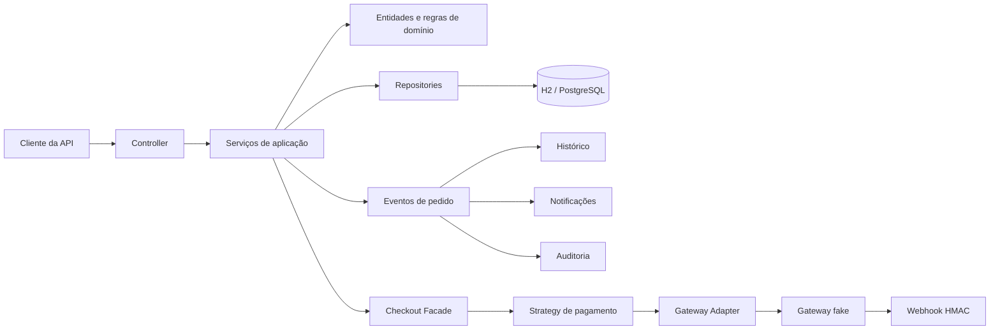

# API de Pedidos


API REST para gerenciamento de usuários, produtos, cupons, pedidos, pagamentos e notificações, desenvolvida com **Java 21** e **Spring Boot**.

Criei este projeto para ir além de um CRUD tradicional. A proposta foi simular problemas encontrados em aplicações reais: autenticação com access e refresh tokens, controle do ciclo de vida de pedidos, idempotência, integração com gateways de pagamento, processamento de webhooks, auditoria, paginação, filtros administrativos, migrations e testes automatizados.

> O projeto tem finalidade de estudo e portfólio, mas foi estruturado com práticas que poderiam ser levadas para uma aplicação de produção.

## Principais destaques

- Autenticação stateless com JWT, refresh token, rotação e revogação.
- Autorização por perfil `USER` e `ADMIN`.
- Ciclo de vida do pedido controlado pelo padrão State.
- Descontos e formas de pagamento implementados com Strategy.
- Gateways de cartão, PIX e boleto isolados por Adapters.
- Checkout centralizado por uma Facade.
- Eventos de domínio com histórico, notificações e auditoria.
- Idempotência em operações sensíveis.
- Webhook fake protegido por assinatura HMAC-SHA256.
- Consultas administrativas com paginação, ordenação e Specifications.
- PostgreSQL, H2, Flyway, Docker e Docker Compose.
- Documentação interativa com Swagger/OpenAPI.
- Testes unitários e de integração com JUnit 5, Mockito e MockMvc.

## Fluxo principal da aplicação

1. O usuário se registra e realiza login.
2. A API emite um access token JWT e um refresh token.
3. O usuário cria um pedido e adiciona produtos.
4. O motor de promoções calcula os descontos aplicáveis.
5. O usuário escolhe cartão, PIX ou boleto para iniciar o pagamento.
6. A estratégia correspondente chama o adapter do gateway fake.
7. Pagamentos pendentes podem ser confirmados por webhook assinado.
8. O pedido muda de estado conforme as regras permitidas.
9. Eventos geram histórico, notificações e registros de auditoria.
10. Administradores podem consultar pedidos por filtros e gerar relatórios.



## Funcionalidades

### Autenticação e segurança

- Registro de usuários com senha armazenada utilizando BCrypt.
- Login com access token e refresh token.
- Renovação com rotação de refresh tokens.
- Detecção de reutilização de refresh token revogado.
- Logout com blacklist do access token.
- Revogação dos refresh tokens do usuário durante o logout.
- Validação do IP e do User-Agent associados ao JWT.
- Bloqueio temporário após tentativas de login inválidas.
- Rate limiting para endpoints protegidos.
- Autorização por perfil e por proprietário do recurso.

### Usuários e produtos

- Cadastro e atualização de usuários.
- Consulta por ID e e-mail.
- Paginação da listagem administrativa.
- Ativação, desativação e remoção de usuários.
- Cadastro, consulta, atualização e remoção de produtos.
- Controle de preço, estoque e situação do produto.

### Pedidos e promoções

- Criação e consulta de pedidos do usuário autenticado.
- Inclusão, alteração e remoção de itens.
- Recálculo de subtotal, descontos e valor final.
- Aplicação de cupons promocionais.
- Estratégias de desconto por quantidade, cupom e cliente VIP.
- Cancelamento, envio, entrega e estorno conforme o estado atual.
- Histórico completo das alterações do pedido.

### Pagamentos e webhooks

- Pagamentos por cartão de crédito, PIX e boleto.
- Gateways fake independentes para cada forma de pagamento.
- Persistência das transações simuladas do gateway.
- Consulta de pagamentos vinculados ao pedido.
- Processamento de confirmação por webhook.
- Validação de assinatura HMAC-SHA256.
- Controle contra processamento duplicado de webhooks.

### Administração e acompanhamento

- Notificações do usuário com controle de leitura.
- Auditoria de eventos importantes do pedido.
- Consulta administrativa com filtros combináveis.
- Paginação e ordenação dos resultados.
- Relatório consolidado de pedidos por período.

## Tecnologias utilizadas

| Tecnologia | Uso no projeto |
|---|---|
| Java 21 | Linguagem principal |
| Spring Boot 3.3.4 | Configuração e execução da aplicação |
| Spring Web | API REST |
| Spring Security | Autenticação e autorização |
| Spring Data JPA | Persistência e consultas |
| Bean Validation | Validação dos dados de entrada |
| PostgreSQL 16 | Banco dos ambientes local, homologação e produção |
| H2 | Desenvolvimento rápido e testes automatizados |
| Flyway | Versionamento e evolução do banco de dados |
| JJWT 0.11.5 | Geração e validação de tokens JWT |
| Caffeine | Cache local de usuários e blacklist |
| Springdoc OpenAPI 2.6.0 | Swagger e especificação OpenAPI |
| Maven | Build e gerenciamento de dependências |
| Docker | Empacotamento da aplicação |
| Docker Compose | Orquestração da API e do PostgreSQL |
| JUnit 5 | Testes automatizados |
| Mockito | Testes unitários com mocks |
| MockMvc | Testes de integração dos endpoints |

## Padrões de projeto aplicados

Os padrões foram utilizados para resolver problemas concretos do domínio, e não apenas para criar exemplos isolados.

### Strategy

Permite adicionar novas regras sem concentrar condicionais no fluxo principal.

**Descontos:**

- `EstrategiaDesconto`
- `DescontoClienteVip`
- `DescontoCupom`
- `DescontoQuantidade`
- `MotorPromocao`

**Pagamentos:**

- `EstrategiaPagamento`
- `PagamentoCartaoCredito`
- `PagamentoPix`
- `PagamentoBoleto`

Uma nova forma de pagamento pode ser criada implementando a interface, sem alterar o serviço que processa os pagamentos.

### State

Cada estado do pedido define quais transições são permitidas. Isso evita que regras de estado fiquem espalhadas em vários `if` e `switch`.

Principais classes:

- `EstadoPedido`
- `EstadoCriado`
- `EstadoAguardandoPagamento`
- `EstadoPago`
- `EstadoEnviado`
- `EstadoEntregue`
- `EstadoCancelamentoSolicitado`
- `EstadoCancelado`
- `EstadoEstornado`
- `EstadoPedidoFactory`

### Observer

Eventos e listeners do Spring desacoplam a operação principal de efeitos secundários.

Quando um pedido é criado, pago, enviado, entregue, cancelado ou estornado, listeners independentes podem registrar:

- Histórico.
- Notificações.
- Auditoria.

Principais classes:

- Eventos em `order/event`.
- `HistoricoPedidoListener`.
- `NotificacaoPedidoListener`.
- `AuditoriaPedidoListener`.

### Adapter

Os adapters escondem os detalhes de integração de cada gateway. O domínio trabalha com uma resposta padronizada, independentemente do formato retornado pelo cartão, PIX ou boleto.

- `GatewayPagamentoAdapter`
- `GatewayCartaoAdapter`
- `GatewayPixAdapter`
- `GatewayBoletoAdapter`

### Facade

A `CheckoutFacade` concentra a coordenação do checkout:

- Busca e valida o pedido.
- Recalcula os valores.
- Inicia o pagamento.
- Interpreta o resultado.
- Atualiza o estado do pedido.
- Processa confirmações recebidas por webhook.

O controller não precisa conhecer todos esses detalhes.

### Specification

A classe `PedidoSpecifications` monta filtros combináveis para consultas administrativas, permitindo pesquisar pedidos por usuário, status, período e valores sem criar um método fixo para cada combinação.

### Factory

As factories selecionam a implementação correta em tempo de execução:

- `EstrategiaPagamentoFactory` seleciona a estratégia pela forma de pagamento.
- `EstadoPedidoFactory` seleciona o comportamento pelo status atual do pedido.

## Princípios SOLID

### Single Responsibility Principle

As responsabilidades foram separadas em serviços específicos, por exemplo:

- `PedidoService`: regras e alterações do pedido.
- `PagamentoService`: processamento e persistência dos pagamentos.
- `CupomService`: gerenciamento dos cupons.
- `NotificacaoService`: notificações do usuário.
- `AuditoriaService`: registros de auditoria.
- `PedidoConsultaService`: consultas administrativas.
- `PedidoUsuarioConsultaService`: consultas do próprio usuário.
- `RelatorioPedidoService`: relatórios consolidados.
- `AutenticacaoService`: login, refresh e logout.

### Open/Closed Principle

O projeto pode receber novas estratégias de desconto, meios de pagamento, estados, listeners e filtros sem alterar o núcleo dos fluxos já existentes.

### Liskov Substitution Principle

As implementações de `EstrategiaPagamento`, `EstrategiaDesconto`, `GatewayPagamentoAdapter` e `EstadoPedido` podem ser substituídas pelas respectivas abstrações sem alterar os consumidores.

### Interface Segregation Principle

As interfaces representam comportamentos específicos do domínio. Uma estratégia de pagamento, por exemplo, não precisa implementar operações que pertencem a notificações, pedidos ou relatórios.

### Dependency Inversion Principle

Os fluxos de alto nível utilizam abstrações para selecionar estratégias, estados e gateways. O Spring injeta as implementações disponíveis, reduzindo o acoplamento entre os componentes.

## Arquitetura do projeto

A aplicação é organizada por domínio. Cada módulo mantém próximas as classes relacionadas ao mesmo contexto.

```text
src/main/java/br/com/api/pedidos
├── audit          # Auditoria de eventos do pedido
├── auth           # Registro, login, refresh token e logout
├── cache          # Nomes e configurações de cache
├── config         # Configurações gerais, tokens e OpenAPI
├── coupon         # Cupons promocionais
├── notification   # Notificações do usuário
├── order          # Pedidos, itens, estados, eventos e consultas
├── payment        # Pagamentos, strategies, adapters e webhooks
├── product        # Produtos
├── report         # Relatórios administrativos
├── security       # JWT, filtros, rate limit e autenticação
├── shared         # Respostas, exceções, paginação e idempotência
└── user           # Usuários e administração de usuários
```

Dentro dos módulos, as classes são separadas conforme a responsabilidade:

- `controller`: contrato HTTP e documentação OpenAPI.
- `service`: casos de uso e regras de aplicação.
- `entity`: entidades e invariantes do domínio.
- `repository`: persistência e consultas.
- `dto`: entrada e saída de dados.
- `strategy`, `state`, `adapter`, `listener` e `specification`: comportamentos específicos.

## Resposta padronizada da API

As respostas seguem um envelope comum:

```json
{
  "sucesso": true,
  "dados": {},
  "mensagem": "Operação realizada com sucesso"
}
```

Erros de validação utilizam o mesmo contrato, colocando os campos inválidos em `dados` e uma mensagem geral em `mensagem`.

## Segurança e confiabilidade

Além do JWT, o projeto implementa outras proteções e controles:

- Senhas protegidas com BCrypt.
- API stateless, sem sessão HTTP no servidor.
- Access token associado ao IP e ao User-Agent.
- Refresh tokens persistidos e rotacionados.
- Blacklist de access tokens após logout.
- Limpeza agendada de tokens e chaves expiradas.
- Bloqueio temporário por tentativas de login.
- Rate limiting de uma requisição protegida por segundo por usuário.
- Autorização por perfil e propriedade do recurso.
- Assinatura HMAC-SHA256 para o webhook fake.
- Comparação segura da assinatura do webhook.
- Idempotência associada à chave, usuário, endpoint, método e hash do payload.

> O rate limiting atual é mantido em memória. Em uma aplicação distribuída, uma evolução natural seria utilizar Redis ou outro armazenamento compartilhado.

## Idempotência

Operações sensíveis recebem o header:

```http
Idempotency-Key: <valor-unico>
```

A chave fica vinculada ao usuário, endpoint, método HTTP e conteúdo da requisição por 24 horas.

- A mesma chave com o mesmo payload retorna a resposta já processada.
- A mesma chave com outro payload é rejeitada.
- O controle reduz o risco de pedidos, pagamentos ou alterações duplicadas.

## Perfis de ambiente

| Perfil | Banco | Swagger | Uso esperado |
|---|---|---:|---|
| `dev` | H2 em memória, em modo de compatibilidade PostgreSQL | Habilitado | Desenvolvimento rápido |
| `local` | PostgreSQL iniciado pelo Docker Compose | Habilitado | API executada pela IDE ou Maven |
| `homolog` | PostgreSQL | Habilitado | Homologação e stack Docker completa |
| `prod` | PostgreSQL | Desabilitado | Produção |
| `test` | H2 em memória | Desabilitado | Testes automatizados |

O perfil padrão é `dev`.

## Variáveis de ambiente

| Variável | Perfil/uso | Descrição |
|---|---|---|
| `DB_NAME` | local/Docker | Nome do banco PostgreSQL |
| `DB_PORT` | local/Docker | Porta publicada do PostgreSQL. Padrão: `5432` |
| `DB_URL` | homolog/prod | URL JDBC completa do PostgreSQL |
| `DB_USERNAME` | PostgreSQL | Usuário do banco |
| `DB_PASSWORD` | PostgreSQL | Senha do banco |
| `API_PORT` | Docker | Porta publicada da API. Padrão: `8080` |
| `JWT_SECRET` | todos, exceto test | Chave JWT com pelo menos 64 caracteres |
| `JWT_EXPIRATION` | segurança | Expiração do access token em milissegundos |
| `JWT_REFRESH_EXPIRATION` | segurança | Expiração do refresh token em milissegundos |
| `JWT_RENEW_BEFORE_EXPIRATION` | segurança | Janela de renovação em milissegundos |
| `FAKE_WEBHOOK_SECRET` | webhook | Segredo HMAC com pelo menos 32 caracteres |

Os arquivos `.env.*.example` servem apenas como modelo. Arquivos com valores reais não devem ser versionados.

> O Spring Boot não carrega arquivos `.env` automaticamente. No ambiente local, as variáveis devem ser carregadas pela configuração da IDE ou exportadas no terminal. No Docker Compose, utilize a opção `--env-file`.

## Pré-requisitos

Para executar sem Docker:

- Java 21.
- Maven 3.9 ou superior.

Para executar a stack completa:

- Docker.
- Docker Compose.

## Como executar com H2

O perfil `dev` utiliza H2 em memória e carrega uma massa inicial de usuários e produtos.

1. Use `.env.dev.example` como referência.
2. Configure `JWT_SECRET` e `FAKE_WEBHOOK_SECRET` na IDE ou no terminal.
3. Execute:

```bash
mvn spring-boot:run -Dspring-boot.run.profiles=dev
```

A API ficará disponível em:

```text
http://localhost:8080
```

Console H2:

```text
http://localhost:8080/h2-console
```

Configuração do H2:

```text
JDBC URL: jdbc:h2:mem:api_pedidos_dev
User Name: sa
Password: deixe em branco
```

Usuário administrador criado somente nos perfis de desenvolvimento e teste:

```text
E-mail: admin@api.com
Senha: 123456
```

## Como executar localmente com PostgreSQL

Neste modo, a API é executada pela IDE ou pelo Maven, enquanto o Spring Boot Docker Compose inicia somente o PostgreSQL.

1. Copie o arquivo de exemplo:

**Windows PowerShell:**

```powershell
Copy-Item .env.local.example .env.local
```

**Linux/macOS:**

```bash
cp .env.local.example .env.local
```

2. Preencha as variáveis no `.env.local`.
3. Carregue esse arquivo na configuração de execução da IDE.
4. Ative o perfil `local`.
5. Execute `ApiDePedidosApplication`.

Pelo Maven, depois de exportar as variáveis no terminal:

```bash
mvn spring-boot:run -Dspring-boot.run.profiles=local
```

O serviço da API no `docker-compose.yml` pertence ao profile `full`. Por isso, o perfil `local` inicia somente o banco e evita que uma segunda instância da API concorra pela porta `8080`.

## Como executar a stack completa com Docker

1. Crie o arquivo `.env.local` a partir do exemplo.
2. Preencha banco, JWT e segredo do webhook.
3. Execute:

```bash
docker compose --env-file .env.local --profile full up --build
```

O fluxo de inicialização é:

1. O PostgreSQL é iniciado.
2. O healthcheck aguarda o banco ficar disponível.
3. A API é iniciada com o perfil `homolog`.
4. O Flyway executa as migrations pendentes.
5. O Hibernate valida o schema.
6. A API fica disponível na porta configurada.

Acompanhar os logs:

```bash
docker compose --env-file .env.local --profile full logs -f
```

Parar os containers:

```bash
docker compose --env-file .env.local --profile full down
```

Parar e remover também o volume do banco:

```bash
docker compose --env-file .env.local --profile full down -v
```

O `Dockerfile` utiliza build multi-stage. A aplicação é compilada em uma imagem Maven e executada em uma imagem menor com Java 21 JRE. O processo final roda com um usuário sem privilégios de root.

## Banco de dados e migrations

O Flyway é responsável pela criação e evolução do schema.

As migrations ficam em:

```text
src/main/resources/db/migration
```

Na versão atual existem migrations para:

- Schema inicial de usuários, produtos, pedidos, tokens e idempotência.
- Histórico, notificações e auditoria.
- Pagamentos.
- Recebimento e processamento de webhooks.
- Índices para consultas administrativas e paginação.
- Persistência das transações do gateway fake.

O Hibernate está configurado com:

```properties
spring.jpa.hibernate.ddl-auto=validate
```

Assim, o Flyway altera o banco e o Hibernate apenas verifica se o modelo Java está compatível com o schema.

## Autenticação JWT

Fluxo básico:

1. Registre um usuário em `POST /auth/registrar`.
2. Faça login em `POST /auth/login`.
3. Envie o access token nos endpoints protegidos:

```http
Authorization: Bearer <access-token>
```

4. Renove a sessão em `POST /auth/refresh`.
5. Finalize a sessão em `POST /auth/logout`.

O logout adiciona o access token à blacklist e revoga os refresh tokens do usuário.

Como o JWT é associado ao IP e ao User-Agent, o token deve ser utilizado no mesmo contexto em que foi emitido.

## Swagger/OpenAPI

Nos perfis `dev`, `local` e `homolog`, a interface fica disponível em:

```text
http://localhost:8080/swagger-ui.html
```

Especificação OpenAPI em JSON:

```text
http://localhost:8080/v3/api-docs
```

Para testar endpoints protegidos:

1. Execute `POST /auth/registrar`, se necessário.
2. Execute `POST /auth/login`.
3. Copie somente o valor de `accessToken`.
4. Clique em `Authorize`.
5. Cole o token sem escrever o prefixo `Bearer`.

O Swagger adiciona o prefixo automaticamente.

## Endpoints principais

### Autenticação

| Método | Endpoint | Acesso |
|---|---|---|
| `POST` | `/auth/registrar` | Público |
| `POST` | `/auth/login` | Público |
| `POST` | `/auth/refresh` | Público |
| `POST` | `/auth/logout` | Autenticado |

### Usuários

| Método | Endpoint | Acesso |
|---|---|---|
| `POST` | `/usuarios` | ADMIN |
| `GET` | `/usuarios/{id}` | Próprio usuário ou ADMIN |
| `GET` | `/usuarios/email` | ADMIN |
| `PATCH` | `/usuarios/{id}` | Próprio usuário ou ADMIN |
| `GET` | `/admin/usuarios` | ADMIN |
| `POST` | `/admin/usuarios/{id}/ativar` | ADMIN |
| `POST` | `/admin/usuarios/{id}/desativar` | ADMIN |
| `DELETE` | `/admin/usuarios/{id}` | ADMIN |

### Produtos

| Método | Endpoint | Acesso |
|---|---|---|
| `GET` | `/produtos` | Autenticado |
| `GET` | `/produtos/{id}` | Autenticado |
| `POST` | `/produtos` | ADMIN |
| `PATCH` | `/produtos/{id}` | ADMIN |
| `DELETE` | `/produtos/{id}` | ADMIN |

### Pedidos

| Método | Endpoint | Acesso |
|---|---|---|
| `GET` | `/orders` | Autenticado |
| `GET` | `/orders/{id}` | Dono do pedido |
| `POST` | `/orders` | Autenticado |
| `POST` | `/orders/{idPedido}/items` | Dono do pedido |
| `PATCH` | `/orders/{idPedido}/items/{itemId}` | Dono do pedido |
| `DELETE` | `/orders/{idPedido}/items/{itemId}` | Dono do pedido |
| `POST` | `/orders/{idPedido}/coupon` | Dono do pedido |
| `POST` | `/orders/{idPedido}/cancel` | Dono do pedido |
| `POST` | `/orders/{idPedido}/ship` | ADMIN |
| `POST` | `/orders/{idPedido}/deliver` | ADMIN |
| `POST` | `/orders/{idPedido}/refund` | ADMIN |
| `GET` | `/orders/{idPedido}/history` | Dono do pedido |
| `GET` | `/admin/orders` | ADMIN |

### Pagamentos

| Método | Endpoint | Acesso |
|---|---|---|
| `POST` | `/orders/{idPedido}/payments` | Dono do pedido |
| `GET` | `/orders/{idPedido}/payments` | Dono do pedido |
| `POST` | `/webhooks/payments/fake` | Público com assinatura HMAC |

O webhook recebe a assinatura no header:

```http
X-Fake-Gateway-Signature: <assinatura-hmac>
```

### Cupons

| Método | Endpoint | Acesso |
|---|---|---|
| `POST` | `/cupons` | ADMIN |
| `GET` | `/cupons` | ADMIN |
| `GET` | `/cupons/{id}` | ADMIN |
| `POST` | `/cupons/{id}/ativar` | ADMIN |
| `POST` | `/cupons/{id}/desativar` | ADMIN |

### Notificações

| Método | Endpoint | Acesso |
|---|---|---|
| `GET` | `/notifications` | Autenticado |
| `GET` | `/notifications/unread-count` | Autenticado |
| `PATCH` | `/notifications/{idNotificacao}/read` | Dono da notificação |

### Relatórios

| Método | Endpoint | Acesso |
|---|---|---|
| `GET` | `/admin/reports/orders/summary` | ADMIN |

A documentação do Swagger contém os parâmetros, exemplos de payload, paginação e respostas possíveis de cada operação.

## Testes

Na versão atual, o projeto possui **19 classes de teste e 72 cenários automatizados**, cobrindo entidades, serviços, listeners, segurança, consultas, relatórios, gateways, webhooks e endpoints.

Entre os cenários testados estão:

- Login e emissão de tokens.
- Validações de cupom, produto e pedido.
- Regras de alteração dos itens.
- Cálculo de descontos.
- Idempotência de pagamentos.
- Permissões de usuário e administrador.
- Filtros e paginação de pedidos.
- Histórico e notificações por eventos.
- Processamento e duplicidade de webhooks.
- Consulta de transações do gateway fake.
- Rate limiting.
- Relatórios administrativos.

Executar todos os testes:

```bash
mvn test
```

Gerar o pacote da aplicação:

```bash
mvn clean package
```

Validar a configuração resolvida do Docker Compose:

```bash
docker compose --env-file .env.local --profile full config
```

## Próximas melhorias

- Utilizar Testcontainers nos testes de integração com PostgreSQL.
- Adicionar Spring Boot Actuator e healthcheck da API.
- Criar pipeline de CI/CD com GitHub Actions.
- Publicar uma imagem versionada em um registry.
- Adicionar logs estruturados, métricas e tracing distribuído.
- Migrar cache e rate limiting para Redis em ambientes distribuídos.
- Integrar um gateway de pagamento real em ambiente sandbox.
- Aplicar Outbox Pattern para publicação confiável de eventos.
- Criar testes automatizados do contrato OpenAPI.
- Realizar deploy em ambiente cloud.

## O que este projeto demonstra

Este repositório demonstra conhecimentos em:

- Desenvolvimento de APIs REST com Spring Boot.
- Modelagem de regras de negócio e estados.
- Segurança com Spring Security e JWT.
- Arquitetura modular e separação de responsabilidades.
- Padrões de projeto aplicados a problemas reais.
- Princípios SOLID.
- Persistência com JPA e versionamento com Flyway.
- Integração por adapters e webhooks.
- Dockerização e configuração por ambiente.
- Testes unitários e de integração.
- Documentação técnica com OpenAPI.

## Autor

Desenvolvido por **Filipe Xavier** como projeto de estudo e portfólio.

- [LinkedIn](https://www.linkedin.com/in/filipex97)
