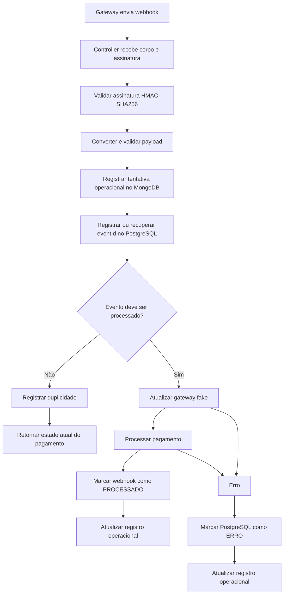

# API de Pedidos


[](https://github.com/FilipeX97/api-de-pedidos/actions/workflows/ci.yml)
[](https://github.com/FilipeX97/api-de-pedidos/actions/workflows/publish-image.yml)

API REST para gerenciamento de usuários, produtos, cupons, pedidos e pagamentos, desenvolvida com **Java 21** e **Spring Boot 3.5.16**.

O projeto foi construído com foco em regras de negócio, segurança, idempotência, padrões de projeto, integração com gateway de pagamento fake, webhooks assinados, persistência poliglota, observabilidade, testes automatizados e execução com Docker.

> O PostgreSQL é a fonte da verdade dos dados transacionais. O MongoDB é utilizado para armazenar os registros operacionais dos webhooks de pagamento.

---

## Funcionalidades

- Autenticação stateless com access token e refresh token.
- Rotação e revogação de refresh tokens.
- Detecção de reutilização de refresh token.
- Blacklist de access tokens após logout.
- Autorização por perfis `USER` e `ADMIN`.
- Senhas protegidas com BCrypt.
- CRUD de usuários, produtos e cupons.
- Criação e gerenciamento de pedidos.
- Controle de estados do pedido.
- Aplicação de descontos e cupons.
- Pagamentos por PIX, cartão de crédito e boleto.
- Gateway de pagamento fake.
- Persistência das transações do gateway fake.
- Idempotência para operações sensíveis.
- Webhook fake com assinatura HMAC-SHA256.
- Controle idempotente de `eventId` dos webhooks.
- Reprocessamento de webhooks que terminaram com erro.
- Registro operacional dos webhooks no MongoDB.
- Paginação, filtros e ordenação nas consultas administrativas.
- Histórico de pedidos.
- Notificações.
- Auditoria.
- Relatórios administrativos.
- Rate limiting.
- Request ID para correlação de requisições e logs.
- Swagger/OpenAPI.
- Spring Boot Actuator.
- Métricas técnicas e de negócio.
- Prometheus.
- Grafana.
- Dashboards provisionados por arquivo.
- SLIs e SLOs.
- Alertas do Prometheus.
- Testes automatizados.
- Docker e Docker Compose.
- GitHub Actions.
- Gitleaks.
- Trivy.
- Dependabot.
- Publicação da imagem no GitHub Container Registry.

---

# Arquitetura

A aplicação é organizada como um monólito modular, mantendo os módulos separados por responsabilidade sem introduzir microserviços artificialmente.

```text
                      ┌─────────────────────┐
                      │      API REST       │
                      └──────────┬──────────┘
                                 │
            ┌────────────────────┼─────────────────────┐
            │                    │                     │
            ▼                    ▼                     ▼
       PostgreSQL            MongoDB              Observabilidade
       Transacional        Operacional            Micrometer
            │                    │                     │
            │                    │                     ▼
            │                    │                Prometheus
            │                    │                     │
            │                    │                     ▼
            │                    │                  Grafana
            │                    │
            └──────────────┬─────┘
                           │
                    Regras de negócio
```

---

# Persistência poliglota

A aplicação utiliza PostgreSQL e MongoDB com responsabilidades distintas.

| Banco | Responsabilidade |
|---|---|
| PostgreSQL | Usuários, produtos, cupons, pedidos, pagamentos, idempotência, tokens, histórico, notificações, auditoria, transações do gateway fake e controle transacional dos webhooks |
| MongoDB | Registros operacionais e documentais dos webhooks de pagamento |

## PostgreSQL

O PostgreSQL concentra os dados transacionais e as regras que exigem consistência forte.

Entre os dados armazenados:

- usuários;
- produtos;
- cupons;
- pedidos;
- itens;
- pagamentos;
- tokens;
- idempotência;
- histórico;
- notificações;
- auditoria;
- transações do gateway fake;
- controle transacional dos webhooks.

O `eventId` dos webhooks é protegido por constraint única no PostgreSQL para impedir processamento duplicado.

## MongoDB

O MongoDB armazena os registros operacionais dos webhooks.

O documento pode conter:

- `eventId`;
- `codigoTransacao`;
- status recebido;
- status do processamento;
- payload original;
- `requestId`;
- tipo do evento;
- origem;
- data de recebimento;
- data de processamento;
- duração;
- indicação de duplicidade;
- mensagem técnica resumida em caso de erro.

Dados sensíveis não são armazenados no documento operacional, como:

- senha;
- access token;
- refresh token;
- chave JWT;
- segredo do webhook;
- senha do banco;
- assinatura HMAC completa.

A gravação operacional no MongoDB segue uma estratégia **best effort**. Uma falha no MongoDB não interrompe o processamento transacional do pagamento no PostgreSQL.

---

# Fluxo do webhook de pagamento



## Estados do registro operacional

| Status | Descrição |
|---|---|
| `RECEBIDO` | Tentativa registrada sem resultado final |
| `PROCESSADO` | Processamento concluído com sucesso |
| `DUPLICADO` | Evento repetido e ignorado |
| `ERRO` | Processamento terminou com erro |

O campo `duplicado` é independente do status final.

Um webhook pode ser:

```json
{
  "statusProcessamento": "PROCESSADO",
  "duplicado": true
}
```

Esse cenário representa um evento repetido que foi reprocessado porque a tentativa anterior havia terminado com erro.

---

# Índices do MongoDB

Coleção:

```text
registro_operacional_webhook_pagamento
```

Índices utilizados:

- `eventId`;
- `codigoTransacao`;
- `statusProcessamento`;
- `requestId`;
- `dataRecebimento`.

O índice de `eventId` não é único, pois o histórico operacional mantém as diferentes tentativas do mesmo evento.

---

# Padrões de projeto

## Strategy

Utilizado para comportamentos intercambiáveis.

### Pagamentos

- cartão de crédito;
- PIX;
- boleto.

### Descontos

- desconto por quantidade;
- cupom;
- cliente VIP;
- motor de promoções.

## State

Utilizado para controlar as transições de estado dos pedidos.

Exemplos:

- criado;
- aguardando pagamento;
- pago;
- enviado;
- entregue;
- cancelamento solicitado;
- cancelado;
- estornado.

## Adapter

Isola o domínio dos formatos específicos dos gateways de pagamento.

## Facade

A `CheckoutFacade` coordena operações relacionadas ao checkout e ao processamento de pagamentos.

## Observer

Eventos e listeners são utilizados para desacoplar efeitos secundários, como:

- histórico;
- notificações;
- auditoria.

## Specification

Utilizada para consultas administrativas com filtros combináveis.

## Factory

Utilizada para selecionar estratégias de pagamento e estados do pedido.

---

# Observabilidade

A aplicação possui uma stack de observabilidade baseada em:

```text
Spring Boot Actuator
        ↓
Micrometer
        ↓
/actuator/prometheus
        ↓
Prometheus
        ↓
PromQL
        ↓
Grafana
```

## Actuator

Endpoints:

```http
GET /actuator/health
GET /actuator/health/liveness
GET /actuator/health/readiness
GET /actuator/info
GET /actuator/prometheus
```

O endpoint:

```http
GET /actuator/metrics
```

é protegido por `ADMIN`.

O endpoint Prometheus é utilizado nos ambientes de desenvolvimento, local e homologação. Em produção, permanece restrito enquanto não existir uma estratégia de exposição interna dedicada.

## Request ID

As respostas possuem:

```http
X-Request-Id
```

Quando o cliente envia um valor válido, ele é preservado. Caso contrário, a API gera um novo identificador.

O mesmo valor é utilizado na correlação dos logs.

Nos webhooks, o Request ID também pode ser armazenado no registro operacional do MongoDB.

---

# Métricas

## Métricas técnicas

Exemplos disponibilizados pelo Spring Boot e Micrometer:

```text
http_server_requests_seconds_count
http_server_requests_seconds_bucket
jvm_memory_used_bytes
jvm_threads_live_threads
process_cpu_usage
process_uptime_seconds
hikaricp_connections_active
```

Essas métricas permitem acompanhar:

- requisições;
- taxa de requisições;
- erros HTTP;
- latência;
- memória JVM;
- threads;
- CPU;
- garbage collection;
- pool de conexões.

## Métricas de negócio

As métricas de negócio são mantidas em classes próprias:

```text
MetricasPedidoService
MetricasPagamentoService
MetricasWebhookService
```

### Pedidos

```text
api_pedidos_pedidos_criados_total
```

### Pagamentos

```text
api_pedidos_pagamentos_iniciados_total
api_pedidos_pagamentos_aprovados_total
api_pedidos_pagamentos_recusados_total
api_pedidos_pagamentos_pendentes_total
```

Os pagamentos utilizam a tag:

```text
forma_pagamento
```

com os valores:

```text
pix
cartao_credito
boleto
```

### Webhooks

```text
api_pedidos_webhooks_recebidos_total
api_pedidos_webhooks_processados_total
api_pedidos_webhooks_duplicados_total
api_pedidos_webhooks_erros_total
```

Também é medido o processamento:

```text
api_pedidos_webhook_processamento_duracao_seconds
```

---

# Cardinalidade das métricas

As métricas não utilizam como tags valores de alta cardinalidade ou dados sensíveis.

Não são utilizadas como tags:

```text
email
nome
idUsuario
idPedido
idPagamento
codigoTransacao
eventId
requestId
payload
token
```

As tags são limitadas a valores com cardinalidade controlada, como:

```text
forma_pagamento
status
```

---

# Prometheus

Configuração:

```text
observability/prometheus/prometheus.yml
```

Intervalo de coleta:

```text
15 segundos
```

O target da API utiliza:

```text
http://api-de-pedidos:8080/actuator/prometheus
```

Dentro do Docker Compose, o nome do serviço é utilizado para comunicação entre containers.

## Recording Rules

```text
observability/prometheus/rules/slo.yml
```

Regras atuais:

```text
api_pedidos:http_requests_rate5m
api_pedidos:http_requests_5xx_rate5m
api_pedidos:http_availability_ratio5m
api_pedidos:http_latency_p95_5m
api_pedidos:webhooks_received_rate5m
api_pedidos:webhooks_error_rate5m
api_pedidos:webhooks_error_ratio5m
```

## Exemplos de PromQL

### API disponível

```promql
up{job="api-de-pedidos"}
```

### Requests por segundo

```promql
sum(
  rate(
    http_server_requests_seconds_count{
      job="api-de-pedidos"
    }[5m]
  )
)
```

### Erros 5xx

```promql
sum(
  rate(
    http_server_requests_seconds_count{
      job="api-de-pedidos",
      status=~"5.."
    }[5m]
  )
)
```

### Memória JVM

```promql
sum(
  jvm_memory_used_bytes{
    job="api-de-pedidos"
  }
)
```

### Pagamentos aprovados

```promql
sum(
  api_pedidos_pagamentos_aprovados_total{
    job="api-de-pedidos"
  }
)
```

### Webhooks duplicados

```promql
sum(
  api_pedidos_webhooks_duplicados_total{
    job="api-de-pedidos"
  }
)
```

---

# Grafana

O Grafana é executado como serviço separado da API.

Acesso:

```text
http://localhost:3000
```

O datasource Prometheus é provisionado automaticamente por:

```text
observability/grafana/provisioning/datasources/prometheus.yml
```

A comunicação entre Grafana e Prometheus utiliza:

```text
http://prometheus:9090
```

## Dashboards

Os dashboards ficam versionados em:

```text
observability/grafana/dashboards/
```

### API de Pedidos - Overview

- requisições por segundo;
- erros 4xx;
- erros 5xx;
- latência p95;
- memória JVM;
- pagamentos aprovados;
- pagamentos recusados;
- webhooks duplicados;
- erros de webhook.

### API de Pedidos - Pagamentos e Webhooks

- pagamentos iniciados;
- pagamentos aprovados;
- pagamentos recusados;
- pagamentos pendentes;
- pagamentos por forma;
- taxa de aprovação;
- webhooks recebidos;
- webhooks processados;
- webhooks duplicados;
- taxa de erro;
- latência p95 de processamento.

### API de Pedidos - JVM e HTTP

- requests por endpoint;
- latência média;
- HTTP 4xx;
- HTTP 5xx;
- heap;
- threads;
- CPU;
- garbage collection;
- conexões Hikari.

### API de Pedidos - SLI e SLO

- disponibilidade HTTP;
- SLO de disponibilidade;
- latência p95;
- SLO de latência;
- erro de webhook;
- SLO operacional de webhook.

---

# SLI e SLO

Os indicadores atuais são:

| Indicador | SLO |
|---|---:|
| Disponibilidade HTTP | >= 99,5% |
| Latência HTTP p95 | <= 500 ms |
| Erro de webhook | < 1% |

## Disponibilidade

A disponibilidade é calculada a partir da relação entre requisições sem erro 5xx e requisições totais.

## Latência

A latência é acompanhada utilizando o percentil p95.

## Webhooks

A taxa de erro dos webhooks é acompanhada como indicador operacional.

## Error Budget

Para um SLO de disponibilidade de 99,5%, a margem correspondente é de:

```text
0,5%
```

---

# Alertas

As regras ficam em:

```text
observability/prometheus/rules/alerts.yml
```

Alertas configurados:

| Alerta | Condição | Tempo |
|---|---|---:|
| `ApiPedidosIndisponivel` | API DOWN | 2 min |
| `ApiPedidosAltaTaxa5xx` | > 5% de 5xx | 5 min |
| `ApiPedidosSloDisponibilidade` | disponibilidade < 99,5% | 10 min |
| `ApiPedidosAltaLatenciaP95` | p95 > 500 ms | 10 min |
| `ApiPedidosAltaTaxaErroWebhook` | erro de webhook > 1% | 10 min |

Os alertas são avaliados pelo Prometheus e ficam disponíveis em:

```text
http://localhost:9090/alerts
```

Nesta etapa, o projeto não utiliza Alertmanager. O Prometheus é responsável pela avaliação das regras e apresentação dos alertas.

---

# Segurança

- API stateless.
- Autenticação com Bearer Token.
- Access token associado ao IP e ao User-Agent.
- Refresh token persistido e rotacionado.
- Detecção de reutilização de refresh token revogado.
- Blacklist de access tokens.
- BCrypt para senhas.
- Perfis `USER` e `ADMIN`.
- Rate limiting local.
- HMAC-SHA256 para webhook fake.
- Comparação segura da assinatura.
- Idempotência por chave, usuário, endpoint, método e hash do payload.
- Respostas sem exposição de stacktrace.
- Tokens, senhas e segredos não são armazenados nos logs operacionais.
- Imagem Docker executada com usuário não root.
- Gitleaks no pipeline.
- Trivy na análise da imagem.

> O rate limiting é mantido em memória. Em uma implantação distribuída, uma evolução natural seria utilizar um mecanismo compartilhado.

---

# Idempotência

Operações sensíveis utilizam:

```http
Idempotency-Key: <chave-unica>
```

A mesma chave e o mesmo payload permitem reutilizar a resposta já processada.

A mesma chave com payload diferente gera conflito.

A chave é vinculada ao contexto da operação, reduzindo o risco de processamento duplicado.

---

# Perfis

| Perfil | Banco transacional | MongoDB | Swagger | Actuator |
|---|---|---|---|---|
| `dev` | H2 em memória | Externo em `localhost` | Habilitado | Health, info e métricas |
| `local` | PostgreSQL via Docker | MongoDB via Docker | Habilitado | Health, info, metrics e Prometheus |
| `homolog` | PostgreSQL | MongoDB | Habilitado | Health, info, metrics e Prometheus |
| `prod` | PostgreSQL | MongoDB | Desabilitado | Health e info |
| `test` | H2 em memória | Conexão real desabilitada nos testes atuais | Desabilitado | Conforme os testes |

O profile padrão é `dev`.

### Readiness

A readiness considera:

```text
readinessState,db
```

O MongoDB não participa diretamente da readiness porque seu uso no processamento crítico é operacional e best effort.

No Docker Compose, PostgreSQL e MongoDB são utilizados como dependências de inicialização da API.

---

# Variáveis de ambiente

## PostgreSQL

| Variável | Descrição |
|---|---|
| `DB_NAME` | Nome do banco |
| `DB_PORT` | Porta publicada |
| `DB_URL` | URL JDBC |
| `DB_USERNAME` | Usuário |
| `DB_PASSWORD` | Senha |

## MongoDB

| Variável | Descrição |
|---|---|
| `MONGO_HOST` | Host |
| `MONGO_PORT` | Porta |
| `MONGO_DATABASE` | Banco |
| `MONGO_USERNAME` | Usuário |
| `MONGO_PASSWORD` | Senha |
| `MONGO_AUTHENTICATION_DATABASE` | Banco de autenticação |

## API e segurança

| Variável | Descrição |
|---|---|
| `API_PORT` | Porta da API |
| `JWT_SECRET` | Chave JWT |
| `JWT_EXPIRATION` | Expiração do access token |
| `JWT_REFRESH_EXPIRATION` | Expiração do refresh token |
| `JWT_RENEW_BEFORE_EXPIRATION` | Janela de renovação |
| `FAKE_WEBHOOK_SECRET` | Segredo HMAC |

## Observabilidade

| Variável | Descrição |
|---|---|
| `PROMETHEUS_PORT` | Porta do Prometheus |
| `GRAFANA_PORT` | Porta do Grafana |
| `GRAFANA_ADMIN_USER` | Usuário administrador |
| `GRAFANA_ADMIN_PASSWORD` | Senha administrador |

Arquivos `.env` reais não devem ser versionados.

Use somente os arquivos:

```text
.env.local.example
.env.homolog.example
```

como referência.

---

# Executando a aplicação

## Profile `dev`

Pré-requisitos:

- Java 21;
- Maven;
- MongoDB disponível em `localhost:27017`.

Execute:

```bash
mvn spring-boot:run -Dspring-boot.run.profiles=dev
```

API:

```text
http://localhost:8080
```

H2:

```text
http://localhost:8080/h2-console
```

Configuração:

```text
JDBC URL: jdbc:h2:mem:api_pedidos_dev
User Name: sa
Password: vazio
```

Credenciais de desenvolvimento:

```text
ADMIN
admin@api.com
123456

USER
user1@teste.com
123456
```

Essas credenciais são destinadas exclusivamente ao ambiente de desenvolvimento/testes.

---

# Executando localmente pela IDE

Copie o arquivo de exemplo.

### PowerShell

```powershell
Copy-Item .env.local.example .env.local
```

### Linux/macOS

```bash
cp .env.local.example .env.local
```

Depois:

1. preencha as variáveis;
2. carregue-as na IDE;
3. ative o profile `local`;
4. execute `ApiDePedidosApplication`.

Pelo Maven:

```bash
mvn spring-boot:run -Dspring-boot.run.profiles=local
```

Nesse cenário, PostgreSQL e MongoDB podem ser executados pelo Docker Compose enquanto a API roda pela IDE.

---

# Executando com Docker

```bash
docker compose \
  --env-file .env.local \
  --profile full \
  up \
  --build
```

Verificar:

```bash
docker compose \
  --env-file .env.local \
  --profile full \
  ps
```

Containers:

```text
api-pedidos-postgres
api-pedidos-mongo
api-pedidos-api
api-pedidos-prometheus
api-pedidos-grafana
```

## Parar

```bash
docker compose \
  --env-file .env.local \
  --profile full \
  down
```

## Remover volumes

```bash
docker compose \
  --env-file .env.local \
  --profile full \
  down \
  -v
```

> `down -v` remove os dados persistidos localmente.

---

# URLs da stack

## API

```text
http://localhost:8080
```

## Swagger

```text
http://localhost:8080/swagger-ui.html
```

## Actuator

```text
http://localhost:8080/actuator
```

## Prometheus

```text
http://localhost:9090
```

Targets:

```text
http://localhost:9090/targets
```

Rules:

```text
http://localhost:9090/rules
```

Alerts:

```text
http://localhost:9090/alerts
```

## Grafana

```text
http://localhost:3000
```

---

# PostgreSQL e MongoDB

## PostgreSQL

```bash
docker compose \
  --env-file .env.local \
  exec postgres \
  psql \
  -U "$DB_USERNAME" \
  -d "$DB_NAME"
```

## MongoDB

```bash
docker compose \
  --env-file .env.local \
  exec mongo \
  sh -lc 'mongosh --username "$MONGO_INITDB_ROOT_USERNAME" --password "$MONGO_INITDB_ROOT_PASSWORD" --authenticationDatabase admin'
```

Depois:

```javascript
use api_pedidos_operacional
show collections

db.registro_operacional_webhook_pagamento
  .find()
  .sort({ dataRecebimento: -1 })
  .pretty()
```

---

# Flyway

Migrations relacionais:

```text
V1__criar_schema_inicial.sql
V2__criar_historico_notificacao_auditoria.sql
V3__criar_tabela_pagamento.sql
V4__criar_tabela_webhook_pagamento_recebido.sql
V5__adicionar_processamento_webhook_pagamento.sql
V6__adicionar_indices_consultas_administrativas.sql
V7__adicionar_indices_paginacao_usuario_notificacao.sql
V8__persistir_transacoes_gateway_fake.sql
```

Hibernate:

```properties
spring.jpa.hibernate.ddl-auto=validate
```

O Flyway evolui o schema e o Hibernate valida a estrutura.

---

# Swagger/OpenAPI

Com `dev`, `local` ou `homolog`:

```text
http://localhost:8080/swagger-ui.html
```

Especificação:

```text
http://localhost:8080/v3/api-docs
```

Para endpoints protegidos:

```text
Authorize
Bearer <access-token>
```

Swagger é desabilitado em `prod`.

---

# Endpoints principais

## Autenticação

```http
POST /auth/login
POST /auth/refresh
POST /auth/registrar
POST /auth/logout
```

## Usuários

```http
POST  /usuarios
GET   /usuarios/{id}
GET   /usuarios/email
PATCH /usuarios/{id}

GET    /admin/usuarios
POST   /admin/usuarios/{id}/ativar
POST   /admin/usuarios/{id}/desativar
DELETE /admin/usuarios/{id}
```

## Produtos

```http
GET    /produtos
GET    /produtos/{id}
POST   /produtos
PATCH  /produtos/{id}
DELETE /produtos/{id}
```

## Cupons

```http
POST /cupons
GET  /cupons
GET  /cupons/{id}
POST /cupons/{id}/ativar
POST /cupons/{id}/desativar
```

## Pedidos

```http
GET    /orders
GET    /orders/{id}
POST   /orders
POST   /orders/{idPedido}/items
PATCH  /orders/{idPedido}/items/{itemId}
DELETE /orders/{idPedido}/items/{itemId}
POST   /orders/{idPedido}/coupon
POST   /orders/{idPedido}/ship
POST   /orders/{idPedido}/deliver
POST   /orders/{idPedido}/cancel
POST   /orders/{idPedido}/refund
GET    /orders/{idPedido}/history
```

## Pagamentos

```http
POST /orders/{idPedido}/payments
GET  /orders/{idPedido}/payments
```

## Webhook

```http
POST /webhooks/payments/fake
```

Header:

```http
X-Fake-Gateway-Signature: <hmac-sha256-do-corpo>
```

## Consulta operacional

```http
GET /admin/webhooks/payments/operational
```

Filtros:

```text
eventId
codigoTransacao
statusProcessamento
dataInicio
dataFim
duplicado
page
size
sort
```

Exemplo:

```http
GET /admin/webhooks/payments/operational
    ?statusProcessamento=ERRO
    &duplicado=true
    &dataInicio=2026-07-28T00:00:00Z
    &dataFim=2026-07-28T23:59:59Z
    &page=0
    &size=20
    &sort=dataRecebimento,desc
```

Acesso restrito a `ADMIN`.

## Notificações

```http
GET   /notifications
GET   /notifications/unread-count
PATCH /notifications/{idNotificacao}/read
```

## Administração e relatórios

```http
GET /admin/orders
GET /admin/reports/orders/summary
```

---

# Coleção Postman

Coleção:

```text
API_de_Pedidos_E2E_Completo_Etapa_16_MongoDB.postman_collection.json
```

Variáveis:

| Variável | Valor |
|---|---|
| `baseUrl` | `http://localhost:8080` |
| `adminEmail` | Usuário ADMIN |
| `adminSenha` | Senha ADMIN |
| `userEmail` | Usuário USER |
| `userSenha` | Senha USER |
| `fakeWebhookSecret` | Mesmo valor de `FAKE_WEBHOOK_SECRET` |

A coleção inclui cenários relacionados ao MongoDB operacional:

- listagem;
- filtros;
- paginação;
- ordenação;
- duplicidade;
- erros;
- acesso administrativo;
- `401`;
- `403`;
- validações.

---

# Testes

Executar toda a suíte:

```bash
mvn -B -ntp test
```

Empacotar:

```bash
mvn -B -ntp clean package
```

A suíte possui cobertura para:

- autenticação;
- refresh token;
- logout;
- usuários;
- produtos;
- cupons;
- pedidos;
- estados;
- pagamentos;
- idempotência;
- gateway fake;
- webhooks;
- duplicidade;
- reprocessamento;
- falhas de processamento;
- persistência operacional;
- MongoDB;
- autorização;
- validação;
- Actuator;
- Prometheus;
- Request ID;
- métricas de pedidos;
- métricas de pagamentos;
- métricas de webhooks;
- timers;
- SLI/SLO.

---

# CI/CD

O pipeline de CI executa:

1. validação das variáveis necessárias;
2. bloqueio de arquivos `.env` reais;
3. Gitleaks;
4. testes Maven;
5. empacotamento;
6. validação dos Docker Compose;
7. validação das regras Prometheus;
8. build da imagem;
9. verificação de usuário não root;
10. análise de vulnerabilidades com Trivy.

A imagem é publicada no GitHub Container Registry:

```text
ghcr.io/filipex97/api-de-pedidos
```

Tags utilizadas:

```text
latest
main
sha-<commit>
vMAJOR.MINOR.PATCH
MAJOR.MINOR.PATCH
MAJOR.MINOR
```

---

# Comandos úteis

## Validar Compose

```bash
docker compose \
  --env-file .env.local \
  --profile full \
  config \
  --quiet
```

## Validar Compose de release

```bash
docker compose \
  --file docker-compose.release.yml \
  --env-file .env.homolog \
  --profile observability \
  config \
  --quiet
```

## Validar configuração do Prometheus

```bash
docker compose \
  --env-file .env.local \
  --profile full \
  run \
  --rm \
  --no-deps \
  --entrypoint promtool \
  prometheus \
  check config /etc/prometheus/prometheus.yml
```

## Validar SLOs

```bash
docker compose \
  --env-file .env.local \
  --profile full \
  run \
  --rm \
  --no-deps \
  --entrypoint promtool \
  prometheus \
  check rules /etc/prometheus/rules/slo.yml
```

## Validar alertas

```bash
docker compose \
  --env-file .env.local \
  --profile full \
  run \
  --rm \
  --no-deps \
  --entrypoint promtool \
  prometheus \
  check rules /etc/prometheus/rules/alerts.yml
```

## Testes

```bash
mvn -B -ntp test
```

## Build

```bash
mvn -B -ntp clean package
```

## Subir stack

```bash
docker compose \
  --env-file .env.local \
  --profile full \
  up \
  --build
```

## Logs

```bash
docker compose \
  --env-file .env.local \
  --profile full \
  logs \
  -f
```

---

# Próximas evoluções

- Testcontainers para PostgreSQL e MongoDB reais.
- Alertmanager para roteamento de notificações.
- Outbox ou mecanismo equivalente para processamento assíncrono.
- Índices adicionais orientados por consultas reais.
- Redis para rate limiting distribuído.
- Kafka ou RabbitMQ para mensageria.
- OpenTelemetry para tracing distribuído.
- Deploy em Kubernetes ou infraestrutura gerenciada.

---

## Autor

**Filipe Xavier**

Projeto desenvolvido com foco em estudo, prática e desenvolvimento de uma API Back-end Java completa.