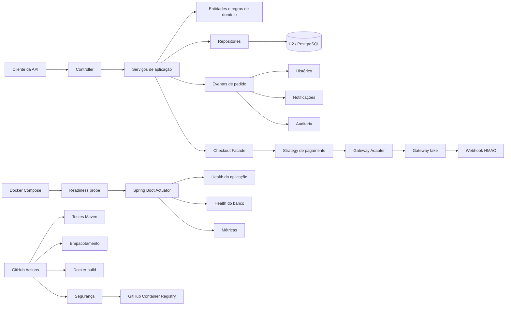

# API de Pedidos


[](https://github.com/FilipeX97/api-de-pedidos/actions/workflows/ci.yml)
[](https://github.com/FilipeX97/api-de-pedidos/actions/workflows/publish-image.yml)

API REST para gerenciamento de usuários, produtos, cupons, pedidos, pagamentos e notificações, desenvolvida com **Java 21** e **Spring Boot**.

Criei este projeto para ir além de um CRUD tradicional. A proposta foi simular problemas encontrados em aplicações reais: autenticação com access e refresh tokens, controle do ciclo de vida de pedidos, idempotência, integração com gateways de pagamento, processamento de webhooks, auditoria, paginação, filtros administrativos, migrations, testes automatizados, observabilidade, integração contínua e entrega contínua de artefatos.

> O projeto tem finalidade de estudo e portfólio, mas foi estruturado com práticas que poderiam ser levadas para uma aplicação de produção.

## Principais destaques

* Autenticação stateless com JWT, refresh token, rotação e revogação.
* Autorização por perfil `USER` e `ADMIN`.
* Ciclo de vida do pedido controlado pelo padrão State.
* Descontos e formas de pagamento implementados com Strategy.
* Gateways de cartão, PIX e boleto isolados por Adapters.
* Checkout centralizado por uma Facade.
* Eventos de domínio com histórico, notificações e auditoria.
* Idempotência em operações sensíveis.
* Webhook fake protegido por assinatura HMAC-SHA256.
* Consultas administrativas com paginação, ordenação e Specifications.
* PostgreSQL, H2, Flyway, Docker e Docker Compose.
* Documentação interativa com Swagger/OpenAPI.
* Observabilidade com Spring Boot Actuator.
* Healthchecks da aplicação e do PostgreSQL.
* Probes de liveness e readiness.
* Métricas de requisições HTTP, JVM e conexões.
* Correlação de logs por meio do header `X-Request-Id`.
* Tratamento seguro de erros internos sem exposição de stacktrace.
* Testes unitários e de integração com JUnit 5, Mockito e MockMvc.
* Pipeline de integração contínua com GitHub Actions.
* Detecção de segredos versionados com Gitleaks.
* Análise de vulnerabilidades críticas da imagem Docker com Trivy.
* Atualização automatizada de dependências com Dependabot.
* Imagem Docker versionada e publicada no GitHub Container Registry.
* Tags rastreáveis por branch, commit e versão semântica.
* Publicação executada somente após o pipeline de CI ser aprovado.
* Imagem reutilizável sem inclusão de credenciais ou arquivos `.env`.

## Fluxo principal da aplicação

1. O usuário se registra e realiza login.
2. A API emite um access token JWT e um refresh token.
3. O usuário cria um pedido e adiciona produtos.
4. O motor de promoções calcula os descontos aplicáveis.
5. O usuário escolhe cartão, PIX ou boleto para iniciar o pagamento.
6. A estratégia correspondente chama o adapter do gateway fake.
7. Pagamentos pendentes podem ser confirmados por webhook assinado.
8. O pedido muda de estado conforme as regras permitidas.
9. Eventos geram histórico, notificações e registros de auditoria.
10. Administradores podem consultar pedidos por filtros e gerar relatórios.
11. O Actuator disponibiliza informações de saúde, runtime e métricas.
12. O Docker Compose verifica automaticamente se a aplicação está pronta.
13. O GitHub Actions valida testes, build Maven, Docker, Compose e segurança.
14. Depois do CI aprovado na `main`, a imagem é publicada de forma versionada no GHCR.



## Funcionalidades

### Autenticação e segurança

* Registro de usuários com senha armazenada utilizando BCrypt.
* Login com access token e refresh token.
* Renovação com rotação de refresh tokens.
* Detecção de reutilização de refresh token revogado.
* Logout com blacklist do access token.
* Revogação dos refresh tokens do usuário durante o logout.
* Validação do IP e do User-Agent associados ao JWT.
* Bloqueio temporário após tentativas de login inválidas.
* Rate limiting para endpoints protegidos.
* Autorização por perfil e por proprietário do recurso.
* Respostas padronizadas para falhas de autenticação e autorização.
* Tratamento seguro de erros internos.

### Usuários e produtos

* Cadastro e atualização de usuários.
* Consulta por ID e e-mail.
* Paginação da listagem administrativa.
* Ativação, desativação e remoção de usuários.
* Cadastro, consulta, atualização e remoção de produtos.
* Controle de preço, estoque e situação do produto.

### Pedidos e promoções

* Criação e consulta de pedidos do usuário autenticado.
* Inclusão, alteração e remoção de itens.
* Recálculo de subtotal, descontos e valor final.
* Aplicação de cupons promocionais.
* Estratégias de desconto por quantidade, cupom e cliente VIP.
* Cancelamento, envio, entrega e estorno conforme o estado atual.
* Histórico completo das alterações do pedido.

### Pagamentos e webhooks

* Pagamentos por cartão de crédito, PIX e boleto.
* Gateways fake independentes para cada forma de pagamento.
* Persistência das transações simuladas do gateway.
* Consulta de pagamentos vinculados ao pedido.
* Processamento de confirmação por webhook.
* Validação de assinatura HMAC-SHA256.
* Controle contra processamento duplicado de webhooks.
* Logs de início e resultado do processamento dos pagamentos.
* Logs de webhooks recebidos, processados, duplicados ou com erro.

### Administração e acompanhamento

* Notificações do usuário com controle de leitura.
* Auditoria de eventos importantes do pedido.
* Consulta administrativa com filtros combináveis.
* Paginação e ordenação dos resultados.
* Relatório consolidado de pedidos por período.

### Observabilidade e monitoramento

* Healthcheck geral da aplicação.
* Healthcheck da conexão com o banco de dados.
* Probes independentes de liveness e readiness.
* Informações sobre nome, versão, ambiente e runtime.
* Métricas de requisições HTTP.
* Métricas da JVM, memória, threads e CPU.
* Métricas de conexões JDBC.
* Healthcheck automático da API pelo Docker Compose.
* Identificação de cada requisição pelo header `X-Request-Id`.
* Inclusão automática do Request ID nos logs.
* Logs operacionais de autenticação, pedidos, pagamentos e webhooks.
* Stacktrace completa apenas nos logs internos.
* Resposta genérica para erros inesperados.

### Integração contínua

* Execução automática em pushes para `main` e `feature/**`.
* Execução automática em pull requests destinados à `main`.
* Validação de arquivos `.env` indevidamente versionados.
* Detecção de segredos no histórico Git.
* Execução dos testes Maven com Java 21.
* Cache de dependências Maven.
* Empacotamento da aplicação.
* Validação da geração do JAR executável.
* Validação sintática do Docker Compose.
* Build da imagem Docker.
* Verificação de execução com usuário sem privilégios.
* Análise de vulnerabilidades críticas da imagem Docker.
* Validação do Compose de release sem impressão de segredos.
* Publicação da imagem no GHCR somente após aprovação do CI na `main`.
* Geração de tags `latest`, `main`, `sha` e versões semânticas.

## Tecnologias utilizadas

| Tecnologia                | Uso no projeto                                     |
| ------------------------- | -------------------------------------------------- |
| Java 21                   | Linguagem principal                                |
| Spring Boot 3.5.16        | Configuração e execução da aplicação               |
| Spring Web                | API REST                                           |
| Spring Security           | Autenticação e autorização                         |
| Spring Data JPA           | Persistência e consultas                           |
| Spring Boot Actuator      | Healthchecks, informações operacionais e métricas  |
| Micrometer                | Coleta e padronização das métricas do Actuator     |
| Bean Validation           | Validação dos dados de entrada                     |
| PostgreSQL 16             | Banco dos ambientes local, homologação e produção  |
| H2                        | Desenvolvimento rápido e testes automatizados      |
| Flyway                    | Versionamento e evolução do banco de dados         |
| JJWT 0.11.5               | Geração e validação de tokens JWT                  |
| Caffeine                  | Cache local de usuários e blacklist                |
| SLF4J e MDC               | Logs e correlação por Request ID                   |
| Springdoc OpenAPI 2.8.17  | Swagger e especificação OpenAPI                    |
| Maven                     | Build e gerenciamento de dependências              |
| Docker                    | Empacotamento da aplicação                         |
| Docker Compose            | Orquestração e healthchecks da API e do PostgreSQL |
| GitHub Container Registry | Armazenamento e distribuição da imagem Docker      |
| GitHub Actions            | Integração contínua e validação automatizada       |
| Gitleaks                  | Detecção de segredos no histórico Git              |
| Trivy                     | Análise de vulnerabilidades da imagem Docker       |
| Dependabot                | Atualização automatizada de dependências           |
| JUnit 5                   | Testes automatizados                               |
| Mockito                   | Testes unitários com mocks                         |
| MockMvc                   | Testes de integração dos endpoints                 |

## Padrões de projeto aplicados

Os padrões foram utilizados para resolver problemas concretos do domínio, e não apenas para criar exemplos isolados.

### Strategy

Permite adicionar novas regras sem concentrar condicionais no fluxo principal.

**Descontos:**

* `EstrategiaDesconto`
* `DescontoClienteVip`
* `DescontoCupom`
* `DescontoQuantidade`
* `MotorPromocao`

**Pagamentos:**

* `EstrategiaPagamento`
* `PagamentoCartaoCredito`
* `PagamentoPix`
* `PagamentoBoleto`

Uma nova forma de pagamento pode ser criada implementando a interface, sem alterar o serviço que processa os pagamentos.

### State

Cada estado do pedido define quais transições são permitidas. Isso evita que regras de estado fiquem espalhadas em vários `if` e `switch`.

Principais classes:

* `EstadoPedido`
* `EstadoCriado`
* `EstadoAguardandoPagamento`
* `EstadoPago`
* `EstadoEnviado`
* `EstadoEntregue`
* `EstadoCancelamentoSolicitado`
* `EstadoCancelado`
* `EstadoEstornado`
* `EstadoPedidoFactory`

### Observer

Eventos e listeners do Spring desacoplam a operação principal de efeitos secundários.

Quando um pedido é criado, pago, enviado, entregue, cancelado ou estornado, listeners independentes podem registrar:

* Histórico.
* Notificações.
* Auditoria.

Principais classes:

* Eventos em `order/event`.
* `HistoricoPedidoListener`.
* `NotificacaoPedidoListener`.
* `AuditoriaPedidoListener`.

### Adapter

Os adapters escondem os detalhes de integração de cada gateway. O domínio trabalha com uma resposta padronizada, independentemente do formato retornado pelo cartão, PIX ou boleto.

* `GatewayPagamentoAdapter`
* `GatewayCartaoAdapter`
* `GatewayPixAdapter`
* `GatewayBoletoAdapter`

### Facade

A `CheckoutFacade` concentra a coordenação do checkout:

* Busca e valida o pedido.
* Recalcula os valores.
* Inicia o pagamento.
* Interpreta o resultado.
* Atualiza o estado do pedido.
* Processa confirmações recebidas por webhook.

O controller não precisa conhecer todos esses detalhes.

### Specification

A classe `PedidoSpecifications` monta filtros combináveis para consultas administrativas, permitindo pesquisar pedidos por usuário, status, período e valores sem criar um método fixo para cada combinação.

### Factory

As factories selecionam a implementação correta em tempo de execução:

* `EstrategiaPagamentoFactory` seleciona a estratégia pela forma de pagamento.
* `EstadoPedidoFactory` seleciona o comportamento pelo status atual do pedido.

## Princípios SOLID

### Single Responsibility Principle

As responsabilidades foram separadas em serviços específicos, por exemplo:

* `PedidoService`: regras e alterações do pedido.
* `PagamentoService`: processamento e persistência dos pagamentos.
* `CupomService`: gerenciamento dos cupons.
* `NotificacaoService`: notificações do usuário.
* `AuditoriaService`: registros de auditoria.
* `PedidoConsultaService`: consultas administrativas.
* `PedidoUsuarioConsultaService`: consultas do próprio usuário.
* `RelatorioPedidoService`: relatórios consolidados.
* `AutenticacaoService`: login, refresh e logout.
* `RequestIdFilter`: geração e propagação do identificador da requisição.
* `InformacoesAplicacaoContributor`: informações operacionais da aplicação.

### Open/Closed Principle

O projeto pode receber novas estratégias de desconto, meios de pagamento, estados, listeners, filtros, métricas e indicadores de saúde sem alterar o núcleo dos fluxos existentes.

### Liskov Substitution Principle

As implementações de `EstrategiaPagamento`, `EstrategiaDesconto`, `GatewayPagamentoAdapter` e `EstadoPedido` podem ser substituídas pelas respectivas abstrações sem alterar os consumidores.

### Interface Segregation Principle

As interfaces representam comportamentos específicos do domínio. Uma estratégia de pagamento, por exemplo, não precisa implementar operações que pertencem a notificações, pedidos, relatórios ou monitoramento.

### Dependency Inversion Principle

Os fluxos de alto nível utilizam abstrações para selecionar estratégias, estados e gateways. O Spring injeta as implementações disponíveis, reduzindo o acoplamento entre os componentes.

## Arquitetura do projeto

A aplicação é organizada por domínio. Cada módulo mantém próximas as classes relacionadas ao mesmo contexto.

```text
src/main/java/br/com/api/pedidos
├── audit           # Auditoria de eventos do pedido
├── auth            # Registro, login, refresh token e logout
├── cache           # Nomes e configurações de cache
├── config          # Configurações gerais, tokens e OpenAPI
├── coupon          # Cupons promocionais
├── notification    # Notificações do usuário
├── observability   # Request ID e informações operacionais
├── order           # Pedidos, itens, estados, eventos e consultas
├── payment         # Pagamentos, strategies, adapters e webhooks
├── product         # Produtos
├── report          # Relatórios administrativos
├── security        # JWT, filtros, rate limit e autenticação
├── shared          # Respostas, exceções, paginação e idempotência
└── user            # Usuários e administração de usuários
```

Dentro dos módulos, as classes são separadas conforme a responsabilidade:

* `controller`: contrato HTTP e documentação OpenAPI.
* `service`: casos de uso e regras de aplicação.
* `entity`: entidades e invariantes do domínio.
* `repository`: persistência e consultas.
* `dto`: entrada e saída de dados.
* `strategy`, `state`, `adapter`, `listener` e `specification`: comportamentos específicos.
* `filter`: filtros HTTP, autenticação, rate limiting e correlação.
* `info`: informações operacionais disponibilizadas pelo Actuator.

A infraestrutura de build, integração contínua e publicação fica organizada da seguinte forma:

```text
.github
├── dependabot.yml
└── workflows
    ├── ci.yml
    └── publish-image.yml

.dockerignore
Dockerfile
docker-compose.yml
docker-compose.release.yml
```

## Resposta padronizada da API

As respostas seguem um envelope comum:

```json
{
  "sucesso": true,
  "dados": {},
  "mensagem": "Operação realizada com sucesso"
}
```

Erros de validação utilizam o mesmo contrato, colocando os campos inválidos em `dados` e uma mensagem geral em `mensagem`.

Os principais status utilizados são:

| Status | Situação                                        |
| -----: | ----------------------------------------------- |
|  `400` | Dados inválidos ou violação de regra de negócio |
|  `401` | Usuário não autenticado ou token inválido       |
|  `403` | Usuário autenticado sem permissão               |
|  `404` | Recurso não encontrado                          |
|  `409` | Conflito de integridade ou idempotência         |
|  `500` | Erro interno inesperado                         |

Em um erro inesperado, o cliente recebe uma mensagem genérica:

```json
{
  "sucesso": false,
  "dados": null,
  "mensagem": "Erro interno no servidor"
}
```

A exceção e a stacktrace completa ficam disponíveis somente nos logs internos.

## Segurança e confiabilidade

Além do JWT, o projeto implementa outras proteções e controles:

* Senhas protegidas com BCrypt.
* API stateless, sem sessão HTTP no servidor.
* Access token associado ao IP e ao User-Agent.
* Refresh tokens persistidos e rotacionados.
* Blacklist de access tokens após logout.
* Limpeza agendada de tokens e chaves expiradas.
* Bloqueio temporário por tentativas de login.
* Rate limiting de uma requisição protegida por segundo por usuário.
* Autorização por perfil e propriedade do recurso.
* Assinatura HMAC-SHA256 para o webhook fake.
* Comparação segura da assinatura do webhook.
* Idempotência associada à chave, usuário, endpoint, método e hash do payload.
* Endpoints de métricas protegidos por perfil `ADMIN`.
* Métricas não expostas no perfil de produção.
* Detalhes internos do healthcheck ocultos em homologação e produção.
* Erros inesperados sem exposição de stacktrace ao cliente.
* Correlação de logs com identificador único por requisição.
* Proibição de registro de senhas, tokens JWT, refresh tokens e segredos HMAC.
* Bloqueio de arquivos `.env` reais no pipeline.
* Detecção de segredos no histórico Git com Gitleaks.
* Execução da imagem Docker com usuário sem privilégios.
* Verificação de vulnerabilidades críticas com Trivy.

> O rate limiting atual é mantido em memória. Em uma aplicação distribuída, uma evolução natural seria utilizar Redis ou outro armazenamento compartilhado.

## Idempotência

Operações sensíveis recebem o header:

```http
Idempotency-Key: <valor-unico>
```

A chave fica vinculada ao usuário, endpoint, método HTTP e conteúdo da requisição por 24 horas.

* A mesma chave com o mesmo payload retorna a resposta já processada.
* A mesma chave com outro payload é rejeitada.
* O controle reduz o risco de pedidos, pagamentos ou alterações duplicadas.

## Perfis de ambiente

| Perfil    | Banco                                                | Swagger      | Actuator exposto                 | Uso esperado                        |
| --------- | ---------------------------------------------------- | ------------ | -------------------------------- | ----------------------------------- |
| `dev`     | H2 em memória, em modo de compatibilidade PostgreSQL | Habilitado   | `health`, `info`, `metrics`      | Desenvolvimento rápido              |
| `local`   | PostgreSQL iniciado pelo Docker Compose              | Habilitado   | `health`, `info`, `metrics`      | API executada pela IDE ou Maven     |
| `homolog` | PostgreSQL                                           | Habilitado   | `health`, `info`, `metrics`      | Homologação e stack Docker completa |
| `prod`    | PostgreSQL                                           | Desabilitado | `health`, `info`                 | Produção                            |
| `test`    | H2 em memória                                        | Desabilitado | Endpoints necessários aos testes | Testes automatizados                |

O perfil padrão é `dev`.

Nos perfis `dev` e `local`, os componentes internos do healthcheck são exibidos para facilitar o desenvolvimento.

Nos perfis `homolog` e `prod`, os detalhes internos são ocultados. O endpoint informa apenas o estado geral da aplicação.

O perfil `test` gera automaticamente uma chave JWT e um segredo de webhook temporários, evitando dependência de credenciais externas durante os testes automatizados.

## Variáveis de ambiente

| Variável                      | Perfil/uso   | Descrição                                   |
| ----------------------------- | ------------ | ------------------------------------------- |
| `DB_NAME`                     | local/Docker | Nome do banco PostgreSQL                    |
| `DB_PORT`                     | local/Docker | Porta publicada. Padrão: `5432`             |
| `DB_URL`                      | homolog/prod | URL JDBC completa do PostgreSQL             |
| `DB_USERNAME`                 | PostgreSQL   | Usuário do banco                            |
| `DB_PASSWORD`                 | PostgreSQL   | Senha do banco                              |
| `API_PORT`                    | Docker       | Porta publicada da API. Padrão: `8080`      |
| `JWT_SECRET`                  | exceto test  | Chave JWT com pelo menos 64 caracteres      |
| `JWT_EXPIRATION`              | segurança    | Expiração do access token em milissegundos  |
| `JWT_REFRESH_EXPIRATION`      | segurança    | Expiração do refresh token em milissegundos |
| `JWT_RENEW_BEFORE_EXPIRATION` | segurança    | Janela de renovação em milissegundos        |
| `FAKE_WEBHOOK_SECRET`         | webhook      | Segredo HMAC com pelo menos 32 caracteres   |

Os arquivos `.env.*.example` servem apenas como modelo. Arquivos com valores reais não devem ser versionados.

> O Spring Boot não carrega arquivos `.env` automaticamente. No ambiente local, as variáveis devem ser carregadas pela configuração da IDE ou exportadas no terminal. No Docker Compose, utilize a opção `--env-file`.

## Pré-requisitos

Para executar sem Docker:

* Java 21.
* Maven 3.9 ou superior.

Para executar a stack completa:

* Docker.
* Docker Compose.

## Como executar com H2

O perfil `dev` utiliza H2 em memória e carrega uma massa inicial de usuários e produtos.

1. Use `.env.dev.example` como referência.
2. Configure `JWT_SECRET` e `FAKE_WEBHOOK_SECRET` na IDE ou no terminal.
3. Execute:

```bash
mvn spring-boot:run -Dspring-boot.run.profiles=dev
```

A API ficará disponível em:

```text
http://localhost:8080
```

Console H2:

```text
http://localhost:8080/h2-console
```

Configuração do H2:

```text
JDBC URL: jdbc:h2:mem:api_pedidos_dev
User Name: sa
Password: deixe em branco
```

Usuário administrador criado somente nos perfis de desenvolvimento e teste:

```text
E-mail: admin@api.com
Senha: 123456
```

Endpoints de observabilidade:

```text
http://localhost:8080/actuator/health
http://localhost:8080/actuator/health/liveness
http://localhost:8080/actuator/health/readiness
http://localhost:8080/actuator/info
```

## Como executar localmente com PostgreSQL

Neste modo, a API é executada pela IDE ou pelo Maven, enquanto o Spring Boot Docker Compose inicia somente o PostgreSQL.

1. Copie o arquivo de exemplo.

**Windows PowerShell:**

```powershell
Copy-Item .env.local.example .env.local
```

**Linux/macOS:**

```bash
cp .env.local.example .env.local
```

2. Preencha as variáveis no `.env.local`.
3. Carregue o arquivo na configuração de execução da IDE.
4. Ative o perfil `local`.
5. Execute `ApiDePedidosApplication`.

Pelo Maven, depois de exportar as variáveis:

```bash
mvn spring-boot:run -Dspring-boot.run.profiles=local
```

O serviço da API no `docker-compose.yml` pertence ao profile `full`. Por isso, o perfil `local` inicia somente o banco e evita que uma segunda instância da API concorra pela porta `8080`.

## Como executar a stack completa com Docker

1. Crie o arquivo `.env.local` a partir do exemplo.
2. Preencha banco, JWT e segredo do webhook.
3. Execute:

```bash
docker compose --env-file .env.local --profile full up --build
```

O fluxo de inicialização é:

1. O PostgreSQL é iniciado.
2. O healthcheck aguarda o PostgreSQL ficar saudável.
3. A API é iniciada com o perfil `homolog`.
4. O Flyway executa as migrations pendentes.
5. O Hibernate valida o schema.
6. O Actuator inicializa os indicadores de saúde.
7. O Docker consulta `/actuator/health/readiness`.
8. A conexão com o banco é validada pelo readiness.
9. O container da API passa para o estado `healthy`.
10. A API fica disponível na porta configurada.

Verificar o estado:

```bash
docker compose --env-file .env.local --profile full ps
```

Resultado esperado:

```text
api-pedidos-postgres   healthy
api-pedidos-api        healthy
```

Acompanhar os logs:

```bash
docker compose --env-file .env.local --profile full logs -f
```

Acompanhar somente a API:

```bash
docker compose --env-file .env.local --profile full logs -f api-de-pedidos
```

Parar os containers:

```bash
docker compose --env-file .env.local --profile full down
```

Parar e remover também o volume:

```bash
docker compose --env-file .env.local --profile full down -v
```

O `Dockerfile` utiliza build multi-stage. A aplicação é compilada em uma imagem Maven e executada em uma imagem menor com Java 21 JRE.

A imagem final instala o `curl`, utilizado pelo healthcheck, e executa o processo Java com um usuário sem privilégios de root.

## Imagem Docker publicada

A imagem da aplicação é publicada no GitHub Container Registry:

```text
ghcr.io/filipex97/api-de-pedidos
```

A publicação ocorre em um workflow separado, localizado em:

```text
.github/workflows/publish-image.yml
```

O workflow utiliza o `GITHUB_TOKEN` fornecido pelo próprio GitHub e recebe a permissão `packages: write` apenas no job responsável pela publicação.

Nenhum segredo da aplicação é utilizado durante o build ou o envio da imagem. Credenciais de banco, chave JWT e segredo do webhook são fornecidos somente quando o container é executado.

### Tags da branch principal

Depois de um CI aprovado na branch `main`, são publicadas tags como:

```text
ghcr.io/filipex97/api-de-pedidos:latest
ghcr.io/filipex97/api-de-pedidos:main
ghcr.io/filipex97/api-de-pedidos:sha-<commit>
```

A tag `latest` representa o commit mais recente da `main` que passou por todas as verificações do pipeline.

### Tags de versões

Uma tag Git no formato `vMAJOR.MINOR.PATCH`, como `v1.0.0`, publica:

```text
ghcr.io/filipex97/api-de-pedidos:v1.0.0
ghcr.io/filipex97/api-de-pedidos:1.0.0
ghcr.io/filipex97/api-de-pedidos:1.0
ghcr.io/filipex97/api-de-pedidos:sha-<commit>
```

A publicação versionada só é permitida quando a tag aponta para um commit pertencente à `main` e esse commit possui uma execução bem-sucedida do workflow de CI.

### Baixar a imagem

Versão mais recente aprovada na `main`:

```bash
docker pull ghcr.io/filipex97/api-de-pedidos:latest
```

Versão específica:

```bash
docker pull ghcr.io/filipex97/api-de-pedidos:v1.0.0
```

Caso o pacote esteja privado, autentique-se no GHCR antes do `pull`. Para uma imagem pública, o download pode ser realizado sem autenticação.

### Executar a imagem publicada com Docker Compose

Copie o arquivo de exemplo.

**Windows PowerShell:**

```powershell
Copy-Item .env.release.example .env.release
```

**Linux/macOS:**

```bash
cp .env.release.example .env.release
```

Preencha as variáveis em `.env.release`. Esse arquivo contém valores locais ou do servidor e não deve ser versionado.

Baixe a imagem configurada:

```bash
docker compose \
  --env-file .env.release \
  --file docker-compose.release.yml \
  pull
```

Inicie os serviços:

```bash
docker compose \
  --env-file .env.release \
  --file docker-compose.release.yml \
  up -d
```

Verifique o estado:

```bash
docker compose \
  --env-file .env.release \
  --file docker-compose.release.yml \
  ps
```

Acompanhe os logs:

```bash
docker compose \
  --env-file .env.release \
  --file docker-compose.release.yml \
  logs -f
```

Pare a stack:

```bash
docker compose \
  --env-file .env.release \
  --file docker-compose.release.yml \
  down
```

Para executar outra versão, altere no `.env.release`:

```dotenv
IMAGE_TAG=v1.0.0
```

O `docker-compose.yml` permanece responsável pelo build local. O `docker-compose.release.yml` utiliza exclusivamente a imagem publicada no GHCR.

### Segurança da imagem

O contexto de build é protegido por `.dockerignore`, que exclui arquivos de ambiente, metadados do Git, artefatos locais, arquivos das IDEs e outros conteúdos que não precisam ser enviados ao builder.

A imagem publicada:

* Não contém arquivos `.env`.
* Não recebe `DB_PASSWORD` durante o build.
* Não recebe `JWT_SECRET` durante o build.
* Não recebe `FAKE_WEBHOOK_SECRET` durante o build.
* Executa com o usuário sem privilégios `app`.
* É analisada pelo Trivy antes da publicação.
* Possui labels OCI que indicam título, descrição, origem e revisão.

## Banco de dados e migrations

O Flyway é responsável pela criação e evolução do schema.

As migrations ficam em:

```text
src/main/resources/db/migration
```

Na versão atual existem migrations para:

* Schema inicial de usuários, produtos, pedidos, tokens e idempotência.
* Histórico, notificações e auditoria.
* Pagamentos.
* Recebimento e processamento de webhooks.
* Índices para consultas administrativas e paginação.
* Persistência das transações do gateway fake.

O Hibernate está configurado com:

```properties
spring.jpa.hibernate.ddl-auto=validate
```

Assim, o Flyway altera o banco e o Hibernate verifica se o modelo Java está compatível com o schema.

## Autenticação JWT

Fluxo básico:

1. Registre um usuário em `POST /auth/registrar`.
2. Faça login em `POST /auth/login`.
3. Envie o access token nos endpoints protegidos:

```http
Authorization: Bearer <access-token>
```

4. Renove a sessão em `POST /auth/refresh`.
5. Finalize a sessão em `POST /auth/logout`.

O logout adiciona o access token à blacklist e revoga os refresh tokens do usuário.

Como o JWT é associado ao IP e ao User-Agent, o token deve ser utilizado no mesmo contexto em que foi emitido.

## Swagger/OpenAPI

Nos perfis `dev`, `local` e `homolog`, a interface fica disponível em:

```text
http://localhost:8080/swagger-ui.html
```

Especificação OpenAPI:

```text
http://localhost:8080/v3/api-docs
```

Para testar endpoints protegidos:

1. Execute `POST /auth/registrar`, se necessário.
2. Execute `POST /auth/login`.
3. Copie somente o valor de `accessToken`.
4. Clique em `Authorize`.
5. Cole o token sem escrever o prefixo `Bearer`.

O Swagger adiciona o prefixo automaticamente.

## Observabilidade

### Endpoints de monitoramento

| Método | Endpoint                     | Finalidade                                 | Acesso  |
| ------ | ---------------------------- | ------------------------------------------ | ------- |
| `GET`  | `/actuator/health`           | Saúde geral da aplicação                   | Público |
| `GET`  | `/actuator/health/liveness`  | Informa se o processo está vivo            | Público |
| `GET`  | `/actuator/health/readiness` | Informa se aplicação e banco estão prontos | Público |
| `GET`  | `/actuator/info`             | Nome, versão, ambiente, Java e Spring Boot | Público |
| `GET`  | `/actuator/metrics`          | Lista as métricas disponíveis              | ADMIN   |
| `GET`  | `/actuator/metrics/{nome}`   | Consulta uma métrica específica            | ADMIN   |

No perfil `prod`, o endpoint de métricas não é exposto.

### Healthcheck geral

```http
GET /actuator/health
```

Em desenvolvimento ou execução local, o retorno pode apresentar os componentes:

```json
{
  "status": "UP",
  "components": {
    "db": {
      "status": "UP"
    },
    "diskSpace": {
      "status": "UP"
    },
    "livenessState": {
      "status": "UP"
    },
    "readinessState": {
      "status": "UP"
    }
  }
}
```

Em homologação e produção, os detalhes ficam ocultos:

```json
{
  "status": "UP"
}
```

### Liveness

```http
GET /actuator/health/liveness
```

O liveness responde se o processo da aplicação continua vivo.

Ele não depende da conexão com o PostgreSQL. Dessa forma, uma indisponibilidade temporária do banco não significa que o processo Java morreu.

### Readiness

```http
GET /actuator/health/readiness
```

O readiness responde se a aplicação está pronta para receber requisições.

O grupo inclui:

* Estado de prontidão da aplicação.
* Conexão com o banco de dados.

Caso o PostgreSQL fique indisponível:

```json
{
  "status": "DOWN"
}
```

O Docker Compose utiliza esse endpoint para determinar a saúde do container da API.

### Informações da aplicação

```http
GET /actuator/info
```

Exemplo:

```json
{
  "app": {
    "name": "api-de-pedidos",
    "description": "API REST para gerenciamento de pedidos e pagamentos"
  },
  "build": {
    "artifact": "api-de-pedidos",
    "name": "api-de-pedidos",
    "version": "0.0.1-SNAPSHOT",
    "group": "br.com.dio"
  },
  "runtime": {
    "ambiente": [
      "homolog"
    ],
    "java": "21.0.5",
    "springBoot": "3.5.16"
  }
}
```

Nenhum segredo, token, senha ou informação sensível é publicado.

### Métricas

Listar métricas:

```http
GET /actuator/metrics
Authorization: Bearer <token-admin>
```

Consultar métricas HTTP:

```http
GET /actuator/metrics/http.server.requests
Authorization: Bearer <token-admin>
```

Outras métricas úteis:

```text
jvm.memory.used
jvm.threads.live
process.uptime
system.cpu.usage
jdbc.connections.active
jdbc.connections.max
http.server.requests
```

### Request ID

Todas as requisições recebem o header:

```http
X-Request-Id: <identificador>
```

Quando o cliente envia um identificador válido, a API preserva o valor.

Quando o header não é enviado ou é inválido, a aplicação gera um UUID.

São aceitos identificadores com:

* Letras.
* Números.
* Ponto.
* Hífen.
* Underscore.
* Até 100 caracteres.

O identificador também é incluído nos logs por meio do MDC:

```text
2026-07-26 18:30:42.154 INFO
[requestId=7f2c3a4e-5478-4bd3-9872-14dc90f0db20]
PagamentoService - Pagamento processado. pagamentoId=10 pedidoId=5 status=APROVADO
```

### Logs operacionais

A aplicação registra eventos importantes, como:

* Login realizado.
* Falha de login.
* Usuário bloqueado ou desativado.
* Pedido criado.
* Pedido cancelado.
* Pagamento iniciado.
* Pagamento processado.
* Webhook recebido.
* Webhook processado.
* Webhook duplicado.
* Erro durante o processamento do webhook.
* Erro em tarefas agendadas.
* Erro inesperado da aplicação.

Os logs nunca devem registrar:

* Senhas.
* Access tokens.
* Refresh tokens.
* Segredos JWT.
* Segredos HMAC.
* Assinaturas completas.
* Credenciais do banco.

## Endpoints principais

### Autenticação

| Método | Endpoint          | Acesso      |
| ------ | ----------------- | ----------- |
| `POST` | `/auth/registrar` | Público     |
| `POST` | `/auth/login`     | Público     |
| `POST` | `/auth/refresh`   | Público     |
| `POST` | `/auth/logout`    | Autenticado |

### Usuários

| Método   | Endpoint                         | Acesso                   |
| -------- | -------------------------------- | ------------------------ |
| `POST`   | `/usuarios`                      | ADMIN                    |
| `GET`    | `/usuarios/{id}`                 | Próprio usuário ou ADMIN |
| `GET`    | `/usuarios/email`                | ADMIN                    |
| `PATCH`  | `/usuarios/{id}`                 | Próprio usuário ou ADMIN |
| `GET`    | `/admin/usuarios`                | ADMIN                    |
| `POST`   | `/admin/usuarios/{id}/ativar`    | ADMIN                    |
| `POST`   | `/admin/usuarios/{id}/desativar` | ADMIN                    |
| `DELETE` | `/admin/usuarios/{id}`           | ADMIN                    |

### Produtos

| Método   | Endpoint         | Acesso      |
| -------- | ---------------- | ----------- |
| `GET`    | `/produtos`      | Autenticado |
| `GET`    | `/produtos/{id}` | Autenticado |
| `POST`   | `/produtos`      | ADMIN       |
| `PATCH`  | `/produtos/{id}` | ADMIN       |
| `DELETE` | `/produtos/{id}` | ADMIN       |

### Pedidos

| Método   | Endpoint                            | Acesso         |
| -------- | ----------------------------------- | -------------- |
| `GET`    | `/orders`                           | Autenticado    |
| `GET`    | `/orders/{id}`                      | Dono do pedido |
| `POST`   | `/orders`                           | Autenticado    |
| `POST`   | `/orders/{idPedido}/items`          | Dono do pedido |
| `PATCH`  | `/orders/{idPedido}/items/{itemId}` | Dono do pedido |
| `DELETE` | `/orders/{idPedido}/items/{itemId}` | Dono do pedido |
| `POST`   | `/orders/{idPedido}/coupon`         | Dono do pedido |
| `POST`   | `/orders/{idPedido}/cancel`         | Dono do pedido |
| `POST`   | `/orders/{idPedido}/ship`           | ADMIN          |
| `POST`   | `/orders/{idPedido}/deliver`        | ADMIN          |
| `POST`   | `/orders/{idPedido}/refund`         | ADMIN          |
| `GET`    | `/orders/{idPedido}/history`        | Dono do pedido |
| `GET`    | `/admin/orders`                     | ADMIN          |

### Pagamentos

| Método | Endpoint                      | Acesso                      |
| ------ | ----------------------------- | --------------------------- |
| `POST` | `/orders/{idPedido}/payments` | Dono do pedido              |
| `GET`  | `/orders/{idPedido}/payments` | Dono do pedido              |
| `POST` | `/webhooks/payments/fake`     | Público com assinatura HMAC |

O webhook recebe a assinatura:

```http
X-Fake-Gateway-Signature: <assinatura-hmac>
```

### Cupons

| Método | Endpoint                 | Acesso |
| ------ | ------------------------ | ------ |
| `POST` | `/cupons`                | ADMIN  |
| `GET`  | `/cupons`                | ADMIN  |
| `GET`  | `/cupons/{id}`           | ADMIN  |
| `POST` | `/cupons/{id}/ativar`    | ADMIN  |
| `POST` | `/cupons/{id}/desativar` | ADMIN  |

### Notificações

| Método  | Endpoint                              | Acesso              |
| ------- | ------------------------------------- | ------------------- |
| `GET`   | `/notifications`                      | Autenticado         |
| `GET`   | `/notifications/unread-count`         | Autenticado         |
| `PATCH` | `/notifications/{idNotificacao}/read` | Dono da notificação |

### Relatórios

| Método | Endpoint                        | Acesso |
| ------ | ------------------------------- | ------ |
| `GET`  | `/admin/reports/orders/summary` | ADMIN  |

## Testes

Na versão atual, o projeto possui **44 classes de teste e mais de 340 métodos de teste**, cobrindo entidades, serviços, estados, strategies, adapters, listeners, segurança, consultas, relatórios, gateways, webhooks, endpoints e observabilidade.

Entre os cenários testados estão:

* Inicialização do contexto Spring.
* Login e emissão de tokens.
* Validações de cupom, produto e pedido.
* Regras de alteração dos itens.
* Cálculo de descontos.
* Transições dos estados do pedido.
* Seleção de estados pela factory.
* Processamento das estratégias de pagamento.
* Integração com adapters dos gateways fake.
* Idempotência de pagamentos.
* Permissões de usuário e administrador.
* Filtros e paginação de pedidos.
* Histórico e notificações por eventos.
* Processamento e duplicidade de webhooks.
* Consulta de transações do gateway fake.
* Rate limiting.
* Relatórios administrativos.
* Healthcheck sem token.
* Liveness e readiness sem token.
* Healthcheck do banco de dados.
* Informações da aplicação sem token.
* Proteção dos endpoints de métricas.
* Geração automática do `X-Request-Id`.
* Preservação do `X-Request-Id` enviado pelo cliente.

Executar todos os testes:

```bash
mvn test
```

Executar uma classe específica:

```bash
mvn -Dtest=ObservabilidadeActuatorITTest test
```

Gerar o pacote:

```bash
mvn clean package
```

Validar o Docker Compose:

```bash
docker compose --env-file .env.local --profile full config
```

## Integração contínua com GitHub Actions

O projeto possui dois workflows separados:

```text
.github/workflows/ci.yml
.github/workflows/publish-image.yml
```

Essa separação mantém responsabilidades e permissões isoladas.

### Workflow de CI

O `ci.yml` é executado em:

* Push para a branch `main`.
* Push para branches `feature/**`.
* Pull request destinado à `main`.
* Execução manual pela aba Actions.

O pipeline executa:

1. Validação dos Secrets e Repository Variables obrigatórios.
2. Verificação de arquivos `.env` reais versionados.
3. Detecção de segredos no histórico Git com Gitleaks.
4. Configuração do Java 21.
5. Cache das dependências Maven.
6. Execução dos testes com o perfil `test` e banco H2.
7. Empacotamento da aplicação.
8. Confirmação da geração do JAR executável.
9. Validação silenciosa do `docker-compose.yml`.
10. Validação silenciosa do `docker-compose.release.yml`.
11. Build da imagem Docker.
12. Verificação de execução com usuário não root.
13. Análise de vulnerabilidades críticas com Trivy.

As informações sensíveis utilizadas pelo pipeline são armazenadas como GitHub Actions Secrets:

* `CI_JWT_SECRET`
* `CI_FAKE_WEBHOOK_SECRET`
* `CI_DB_PASSWORD`

As configurações não sensíveis são armazenadas como Repository Variables:

* `CI_DB_NAME`
* `CI_DB_USERNAME`
* `CI_DB_PORT`
* `CI_API_PORT`
* `CI_JWT_EXPIRATION`
* `CI_JWT_REFRESH_EXPIRATION`
* `CI_JWT_RENEW_BEFORE_EXPIRATION`

Nenhum valor sensível é escrito no workflow, criado em arquivo `.env` ou impresso intencionalmente nos logs.

A validação dos arquivos Compose utiliza `config --quiet`, que verifica a configuração sem imprimir o conteúdo resolvido.

### Workflow de publicação

O `publish-image.yml` publica a imagem no GitHub Container Registry.

Para a branch `main`, a publicação só começa depois que o workflow `CI` termina com sucesso. Um CI de pull request, uma execução com falha ou uma execução originada por outro repositório não publica a imagem.

Para tags versionadas, o workflow confirma:

* Formato `vMAJOR.MINOR.PATCH`.
* Pertencimento do commit à branch `main`.
* Existência de uma execução bem-sucedida do CI para o commit.

O workflow utiliza somente o `GITHUB_TOKEN` fornecido pelo GitHub. A permissão `packages: write` fica limitada ao job de publicação.

Nenhum segredo da aplicação é fornecido durante o build ou a publicação da imagem.

A etapa atual implementa integração contínua e entrega contínua do artefato Docker. O deploy da aplicação em um ambiente ainda não é executado automaticamente.

## Dependabot

O Dependabot está configurado em:

```text
.github/dependabot.yml
```

São monitorados:

* Dependências Maven.
* GitHub Actions.
* Imagens do Dockerfile.
* Imagens do Docker Compose.

As verificações são executadas semanalmente e as atualizações são propostas por pull requests.

## Proteção da branch principal

Depois que o workflow executar com sucesso, a branch `main` deve ser protegida com:

* Pull request obrigatório.
* Status checks obrigatórios.
* Branch atualizada antes do merge.
* Conversas resolvidas antes do merge.
* Bloqueio de force push.
* Bloqueio de exclusão da branch.

Checks recomendados:

```text
CI / Configuração
CI / Segredos
CI / Testes Maven
CI / Empacotamento Maven
CI / Docker Compose
CI / Docker e Segurança
```

## Próximas melhorias

* Utilizar Testcontainers nos testes de integração com PostgreSQL.
* Realizar deploy automático em ambiente cloud.
* Exportar métricas no formato Prometheus.
* Criar dashboards de monitoramento com Grafana.
* Adicionar tracing distribuído com OpenTelemetry.
* Centralizar logs com Loki ou Elasticsearch.
* Criar alertas para aumento de erros HTTP `500`.
* Criar alertas para indisponibilidade do readiness.
* Migrar cache e rate limiting para Redis.
* Integrar um gateway de pagamento real em ambiente sandbox.
* Aplicar Outbox Pattern para publicação confiável de eventos.
* Criar testes automatizados do contrato OpenAPI.
* Publicar imagem para múltiplas arquiteturas, como `linux/amd64` e `linux/arm64`.
* Assinar imagens publicadas com Sigstore Cosign.
* Gerar e publicar SBOM das imagens.
* Configurar retenção de versões antigas no GHCR.

## O que este projeto demonstra

Este repositório demonstra conhecimentos em:

* Desenvolvimento de APIs REST com Spring Boot.
* Modelagem de regras de negócio e estados.
* Segurança com Spring Security e JWT.
* Arquitetura modular e separação de responsabilidades.
* Padrões de projeto aplicados a problemas reais.
* Princípios SOLID.
* Persistência com JPA e versionamento com Flyway.
* Integração por adapters e webhooks.
* Dockerização e configuração por ambiente.
* Healthchecks de aplicação e banco de dados.
* Probes de liveness e readiness.
* Monitoramento com Spring Boot Actuator.
* Coleta de métricas com Micrometer.
* Correlação de logs utilizando MDC e Request ID.
* Tratamento seguro de falhas inesperadas.
* Testes unitários e de integração.
* Documentação técnica com OpenAPI.
* Integração contínua com GitHub Actions.
* Detecção automatizada de segredos.
* Análise de vulnerabilidades em imagens.
* Manutenção automatizada de dependências.
* Publicação segura de imagens no GitHub Container Registry.
* Versionamento de imagens por branch, commit e versão semântica.
* Separação entre build da imagem e configuração de runtime.
* Continuous Delivery de artefatos Docker.

## Autor

Desenvolvido por **Filipe Xavier** como projeto de estudo e portfólio.

* [LinkedIn](https://www.linkedin.com/in/filipex97)
