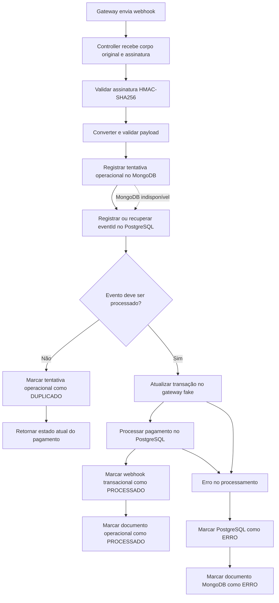

# API de Pedidos


[](https://github.com/FilipeX97/api-de-pedidos/actions/workflows/ci.yml)
[](https://github.com/FilipeX97/api-de-pedidos/actions/workflows/publish-image.yml)

API REST de estudo e portfólio para gerenciamento de usuários, produtos, cupons, pedidos e pagamentos. O projeto foi desenvolvido com **Java 21** e **Spring Boot 3.5.16**, indo além de um CRUD tradicional ao implementar autenticação JWT, idempotência, padrões de projeto, integração com gateway fake, webhooks assinados, persistência poliglota, observabilidade, testes automatizados, Docker e CI/CD.

> O PostgreSQL permanece como fonte da verdade dos dados transacionais. O MongoDB armazena registros operacionais e documentais dos webhooks de pagamento para consulta, diagnóstico e investigação técnica.

---

## Principais destaques

- Autenticação stateless com access token e refresh token.
- Rotação, revogação e detecção de reutilização de refresh token.
- Blacklist de access tokens após logout.
- Autorização por perfis `USER` e `ADMIN`.
- Senhas protegidas com BCrypt.
- Pedidos controlados pelo padrão **State**.
- Descontos e pagamentos implementados com **Strategy**.
- Gateways de pagamento isolados por **Adapter**.
- Checkout coordenado por **Facade**.
- Eventos de domínio e listeners no estilo **Observer**.
- Consultas administrativas combináveis.
- Idempotência em operações sensíveis.
- Pagamentos por PIX, cartão e boleto.
- Gateway fake com transações persistidas no PostgreSQL.
- Webhook fake protegido por assinatura HMAC-SHA256.
- Controle transacional e idempotente de webhooks no PostgreSQL.
- Registro operacional de webhooks no MongoDB.
- Estratégia **best effort**: falhas no MongoDB não interrompem pagamentos.
- Paginação, ordenação e filtros administrativos.
- Migrations com Flyway.
- Documentação com Swagger/OpenAPI.
- Observabilidade com Spring Boot Actuator.
- Correlação de logs pelo header `X-Request-Id`.
- Testes com JUnit 5, Mockito, MockMvc e Spring Security Test.
- Pipeline de CI com GitHub Actions.
- Detecção de segredos com Gitleaks.
- Verificação de vulnerabilidades da imagem com Trivy.
- Publicação da imagem no GitHub Container Registry.
- Atualização automatizada de dependências com Dependabot.

---

## Arquitetura e persistência poliglota

A aplicação utiliza dois bancos com responsabilidades diferentes:

| Banco | Responsabilidade |
|---|---|
| PostgreSQL | Fonte da verdade para usuários, produtos, cupons, pedidos, pagamentos, idempotência, tokens, histórico, notificações, auditoria, transações do gateway fake e controle transacional dos webhooks |
| MongoDB | Registros operacionais e documentais das tentativas de webhook, incluindo payload original, Request ID, duração, duplicidade, resultado e mensagem técnica de erro |

### Por que o PostgreSQL continua sendo a fonte da verdade?

Pedidos e pagamentos exigem:

- integridade referencial;
- constraints;
- transações;
- consistência forte;
- relacionamentos;
- controle confiável de duplicidade;
- relatórios oficiais.

O `eventId` utilizado para impedir o processamento repetido continua protegido por constraint única no PostgreSQL.

### Por que usar MongoDB para o registro operacional?

O payload e os metadados de webhooks podem variar conforme o gateway e evoluir com o tempo. O modelo documental permite guardar essas informações de forma flexível, sem transformar o MongoDB na fonte oficial do pagamento.

O documento operacional registra:

- `eventId`;
- `codigoTransacao`;
- status recebido;
- status do processamento;
- payload original;
- `requestId`;
- tipo do evento;
- origem;
- data de recebimento;
- data de processamento;
- duração em milissegundos;
- indicação de duplicidade;
- mensagem técnica resumida em caso de erro.

Não são persistidos no documento:

- senha;
- access token;
- refresh token;
- chave JWT;
- segredo do webhook;
- senha do banco;
- assinatura HMAC completa.

---

## Fluxo do webhook de pagamento



### Consistência eventual e best effort

A gravação operacional no MongoDB é executada em modo best effort:

- a exceção é registrada nos logs;
- o processamento transacional continua;
- o pagamento não é recusado apenas porque o MongoDB está indisponível;
- o registro operacional pode ficar ausente ou incompleto em uma falha de infraestrutura.

A consulta administrativa depende do MongoDB. Portanto, caso ele esteja indisponível, o endpoint operacional pode falhar sem comprometer os pagamentos já controlados pelo PostgreSQL.

---

## Estados do registro operacional

| Status | Significado |
|---|---|
| `RECEBIDO` | A tentativa foi registrada, mas ainda não recebeu resultado final |
| `PROCESSADO` | A tentativa foi processada com sucesso |
| `DUPLICADO` | O `eventId` já havia sido processado e a nova tentativa foi ignorada |
| `ERRO` | A tentativa terminou com erro |

O campo booleano `duplicado` é independente do status final. Assim, é possível existir:

```json
{
  "statusProcessamento": "PROCESSADO",
  "duplicado": true
}
```

Esse caso representa um `eventId` repetido que foi reprocessado porque a tentativa anterior havia terminado com erro.

---

## Índices do MongoDB

A coleção utilizada é:

```text
registro_operacional_webhook_pagamento
```

Índices declarados no documento:

- `eventId`;
- `codigoTransacao`;
- `statusProcessamento`;
- `requestId`;
- `dataRecebimento`.

O índice de `eventId` **não é único**, pois o objetivo operacional é visualizar todas as tentativas recebidas, inclusive repetições do mesmo evento.

---

## Tecnologias utilizadas

| Tecnologia | Uso |
|---|---|
| Java 21 | Linguagem principal |
| Spring Boot 3.5.16 | Configuração e execução |
| Spring Web / MVC | API REST |
| Spring Security 6.5.11 | Autenticação e autorização |
| Spring Data JPA | Persistência relacional |
| Spring Data MongoDB | Persistência documental |
| PostgreSQL 16 | Banco transacional |
| MongoDB 8.0 | Registros operacionais de webhooks |
| H2 | Desenvolvimento rápido e testes |
| Flyway | Versionamento do schema relacional |
| JJWT 0.11.5 | Tokens JWT |
| Caffeine | Cache local |
| Bean Validation | Validação de entrada |
| Springdoc OpenAPI 2.8.17 | Swagger/OpenAPI |
| Spring Boot Actuator | Healthchecks, informações e métricas |
| SLF4J e MDC | Logs e correlação por Request ID |
| Maven | Build e dependências |
| Docker / Docker Compose | Empacotamento e orquestração |
| JUnit 5 | Testes automatizados |
| Mockito | Testes unitários |
| MockMvc | Testes HTTP |
| GitHub Actions | Integração contínua |
| GHCR | Registro de imagens Docker |
| Gitleaks | Detecção de segredos |
| Trivy | Análise de vulnerabilidades |
| Dependabot | Atualização de dependências |

---

## Padrões de projeto

### Strategy

Usado para encapsular comportamentos intercambiáveis.

**Descontos**

- desconto por quantidade;
- cupom;
- cliente VIP;
- motor de promoções.

**Pagamentos**

- cartão de crédito;
- PIX;
- boleto.

### State

Controla as transições do pedido e impede mudanças inválidas de estado.

Exemplos:

- criado;
- aguardando pagamento;
- pago;
- enviado;
- entregue;
- cancelamento solicitado;
- cancelado;
- estornado.

### Adapter

Isola o domínio dos formatos específicos de cada gateway de pagamento.

### Facade

A `CheckoutFacade` centraliza a coordenação do checkout, pagamento e confirmação por webhook.

### Observer

Eventos e listeners desacoplam efeitos secundários, como:

- histórico;
- notificações;
- auditoria.

### Specification

Utilizada nas consultas administrativas relacionais com filtros combináveis.

### Factory

Seleciona estratégias de pagamento e estados do pedido em tempo de execução.

---

## Organização do projeto

```text
src/main/java/br/com/api/pedidos
├── audit
├── auth
├── cache
├── config
├── coupon
├── notification
├── observability
├── order
├── payment
│   └── webhook
│       ├── controller
│       ├── dto
│       ├── entity
│       ├── repository
│       ├── service
│       └── document
│           ├── controller
│           ├── dto
│           ├── entity
│           ├── repository
│           └── service
├── product
├── report
├── security
├── shared
└── user
```

Dentro dos módulos:

- `controller`: contrato HTTP e OpenAPI;
- `service`: casos de uso e regras de aplicação;
- `entity`: entidades e invariantes;
- `document`: documentos MongoDB;
- `repository`: acesso a dados;
- `dto`: entrada e saída;
- `strategy`, `state`, `adapter`, `factory`, `listener` e `specification`: comportamentos especializados.

---

## Resposta padronizada

Sucesso:

```json
{
  "sucesso": true,
  "dados": {},
  "mensagem": "Operação realizada com sucesso"
}
```

Erro:

```json
{
  "sucesso": false,
  "dados": null,
  "mensagem": "Descrição do erro"
}
```

Principais códigos HTTP:

| Código | Uso |
|---:|---|
| 200 | Consulta ou alteração concluída |
| 201 | Recurso criado |
| 400 | Entrada inválida ou regra de negócio violada |
| 401 | Token ausente, inválido, expirado ou bloqueado |
| 403 | Usuário autenticado sem permissão |
| 404 | Recurso não encontrado |
| 409 | Conflito de integridade ou idempotência |
| 429 | Rate limit excedido |
| 500 | Falha interna inesperada |

---

## Segurança

- API stateless.
- Autenticação com Bearer Token.
- Access token associado ao IP e ao User-Agent.
- Refresh token persistido e rotacionado.
- Detecção de reutilização de refresh token revogado.
- Blacklist de access tokens.
- BCrypt para senhas.
- Perfis `USER` e `ADMIN`.
- Rate limiting local.
- HMAC-SHA256 para webhook fake.
- Comparação segura da assinatura.
- Idempotência por chave, usuário, endpoint, método e hash do payload.
- Respostas internas sem exposição de stacktrace.
- Proibição de registrar tokens, senhas e segredos nos logs operacionais.
- Execução da imagem Docker com usuário não root.
- Gitleaks no pipeline.
- Trivy na imagem Docker.

> O rate limiting é mantido em memória. Em uma implantação distribuída, uma evolução natural seria usar Redis ou outro armazenamento compartilhado.

---

## Idempotência

Operações sensíveis recebem:

```http
Idempotency-Key: <chave-unica>
```

Comportamento:

- mesma chave e mesmo payload: devolve a resposta já processada;
- mesma chave e payload diferente: rejeita a requisição;
- a chave fica vinculada ao usuário, endpoint e método;
- reduz o risco de pedidos, itens, pagamentos e transições duplicadas.

---

## Perfis

| Perfil | Banco transacional | MongoDB | Swagger | Actuator |
|---|---|---|---|---|
| `dev` | H2 em memória | Externo em `localhost` | Habilitado | `health`, `info`, `metrics` com detalhes |
| `local` | PostgreSQL via Docker Compose | MongoDB via Docker Compose | Habilitado | `health`, `info`, `metrics` com detalhes |
| `homolog` | PostgreSQL | MongoDB | Habilitado | `health`, `info`, `metrics`, sem detalhes internos |
| `prod` | PostgreSQL | MongoDB | Desabilitado | `health` e `info`, sem detalhes internos |
| `test` | H2 em memória | Conexão real desabilitada nos testes atuais | Desabilitado | Apenas o necessário aos testes |

O profile padrão é `dev`.

### Readiness

A readiness inclui:

```text
readinessState,db
```

Ela valida a aplicação e o banco relacional. O MongoDB não participa da readiness porque seu uso no processamento crítico é operacional e best effort.

No Docker Compose, entretanto, a API aguarda PostgreSQL e MongoDB ficarem saudáveis antes de iniciar.

---

## Variáveis de ambiente

### PostgreSQL

| Variável | Descrição |
|---|---|
| `DB_NAME` | Nome do banco |
| `DB_PORT` | Porta publicada, padrão `5432` |
| `DB_URL` | URL JDBC completa em homologação/produção |
| `DB_USERNAME` | Usuário |
| `DB_PASSWORD` | Senha |

### MongoDB

| Variável | Descrição |
|---|---|
| `MONGO_HOST` | Host do MongoDB |
| `MONGO_PORT` | Porta, padrão `27017` |
| `MONGO_DATABASE` | Banco operacional |
| `MONGO_USERNAME` | Usuário |
| `MONGO_PASSWORD` | Senha |
| `MONGO_AUTHENTICATION_DATABASE` | Banco de autenticação, padrão `admin` |

### API e segurança

| Variável | Descrição |
|---|---|
| `API_PORT` | Porta publicada da API, padrão `8080` |
| `JWT_SECRET` | Chave JWT com pelo menos 64 caracteres |
| `JWT_EXPIRATION` | Expiração do access token em milissegundos |
| `JWT_REFRESH_EXPIRATION` | Expiração do refresh token em milissegundos |
| `JWT_RENEW_BEFORE_EXPIRATION` | Janela de renovação |
| `FAKE_WEBHOOK_SECRET` | Segredo HMAC do webhook fake |

Nunca versione arquivos `.env` reais. Somente arquivos `.env.*.example` devem permanecer no Git.

O Spring Boot não carrega `.env` automaticamente. Configure as variáveis na IDE, exporte-as no terminal ou use `--env-file` com Docker Compose.

---

## Pré-requisitos

Execução sem container da API:

- Java 21;
- Maven 3.9 ou superior;
- MongoDB disponível para os profiles que habilitam o documento operacional.

Stack completa:

- Docker;
- Docker Compose.

---

## Executar com o profile `dev`

O profile `dev` usa H2 para os dados transacionais e MongoDB para os registros operacionais.

1. Configure as variáveis JWT, webhook e MongoDB.
2. Garanta que o MongoDB esteja disponível em `localhost:27017`.
3. Execute:

```bash
mvn spring-boot:run -Dspring-boot.run.profiles=dev
```

API:

```text
http://localhost:8080
```

Console H2:

```text
http://localhost:8080/h2-console
```

Configuração:

```text
JDBC URL: jdbc:h2:mem:api_pedidos_dev
User Name: sa
Password: vazio
```

Massa inicial criada em `dev` e `test`:

```text
ADMIN
E-mail: admin@api.com
Senha: 123456

USER
E-mail: user1@teste.com
Senha: 123456
```

Essas credenciais são apenas para desenvolvimento e testes.

---

## Executar localmente pela IDE

Neste modo, a API roda pela IDE ou Maven e o Spring Boot Docker Compose inicia PostgreSQL e MongoDB.

1. Copie o arquivo de exemplo:

**PowerShell**

```powershell
Copy-Item .env.local.example .env.local
```

**Linux/macOS**

```bash
cp .env.local.example .env.local
```

2. Preencha todas as variáveis.
3. Carregue o `.env.local` na configuração da IDE.
4. Ative o profile `local`.
5. Execute `ApiDePedidosApplication`.

Pelo Maven:

```bash
mvn spring-boot:run -Dspring-boot.run.profiles=local
```

O serviço da API no `docker-compose.yml` pertence ao profile Compose `full`, evitando uma segunda instância concorrendo com a API executada pela IDE.

---

## Executar a stack completa com Docker

```bash
docker compose --env-file .env.local --profile full up --build
```

Verificar:

```bash
docker compose --env-file .env.local --profile full ps
```

Containers esperados:

```text
api-pedidos-postgres
api-pedidos-mongo
api-pedidos-api
```

Logs:

```bash
docker compose --env-file .env.local --profile full logs -f
```

Somente API:

```bash
docker compose --env-file .env.local --profile full logs -f api-de-pedidos
```

Parar:

```bash
docker compose --env-file .env.local --profile full down
```

Parar e remover volumes locais:

```bash
docker compose --env-file .env.local --profile full down -v
```

> `down -v` apaga os dados locais do PostgreSQL e do MongoDB.

---

## Validar os bancos

### PostgreSQL

```bash
docker compose --env-file .env.local exec postgres \
  psql -U "$DB_USERNAME" -d "$DB_NAME"
```

### MongoDB

```bash
docker compose --env-file .env.local exec mongo \
  sh -lc 'mongosh --username "$MONGO_INITDB_ROOT_USERNAME" --password "$MONGO_INITDB_ROOT_PASSWORD" --authenticationDatabase admin'
```

No `mongosh`:

```javascript
show dbs
use api_pedidos_operacional
show collections

db.registro_operacional_webhook_pagamento
  .find()
  .sort({ dataRecebimento: -1 })
  .pretty()
```

Índices:

```javascript
db.registro_operacional_webhook_pagamento.getIndexes()
```

---

## Flyway

Migrations relacionais atuais:

```text
V1__criar_schema_inicial.sql
V2__criar_historico_notificacao_auditoria.sql
V3__criar_tabela_pagamento.sql
V4__criar_tabela_webhook_pagamento_recebido.sql
V5__adicionar_processamento_webhook_pagamento.sql
V6__adicionar_indices_consultas_administrativas.sql
V7__adicionar_indices_paginacao_usuario_notificacao.sql
V8__persistir_transacoes_gateway_fake.sql
```

O Hibernate está configurado com:

```properties
spring.jpa.hibernate.ddl-auto=validate
```

O Flyway cria e evolui o schema; o Hibernate apenas valida o resultado.

O MongoDB não utiliza migrations Flyway. Os índices documentais são criados pelo Spring Data MongoDB nos profiles com:

```properties
spring.data.mongodb.auto-index-creation=true
```

---

## Swagger/OpenAPI

Com a aplicação executando em `dev`, `local` ou `homolog`:

```text
http://localhost:8080/swagger-ui.html
```

Especificação:

```text
http://localhost:8080/v3/api-docs
```

Para endpoints protegidos:

```text
Authorize
Bearer <access-token>
```

O Swagger é desabilitado no profile `prod`.

---

## Observabilidade

Endpoints públicos:

```text
GET /actuator/health
GET /actuator/health/liveness
GET /actuator/health/readiness
GET /actuator/info
```

Métricas protegidas por `ADMIN`:

```text
GET /actuator/metrics
GET /actuator/metrics/{nome}
```

### Request ID

Toda resposta recebe:

```http
X-Request-Id: identificador
```

Quando o cliente envia um valor válido, ele é preservado. Caso não envie, a API gera um novo identificador.

O mesmo valor é adicionado ao MDC e aparece nos logs:

```text
[requestId=abc-123]
```

O documento MongoDB também armazena o Request ID do webhook, permitindo correlacionar:

```text
requisição HTTP
↔ logs
↔ documento operacional
```

---

## Endpoints principais

### Autenticação

```http
POST /auth/login
POST /auth/refresh
POST /auth/registrar
POST /auth/logout
```

### Usuários

```http
POST  /usuarios
GET   /usuarios/{id}
GET   /usuarios/email
PATCH /usuarios/{id}

GET    /admin/usuarios
POST   /admin/usuarios/{id}/ativar
POST   /admin/usuarios/{id}/desativar
DELETE /admin/usuarios/{id}
```

### Produtos

```http
GET    /produtos
GET    /produtos/{id}
POST   /produtos
PATCH  /produtos/{id}
DELETE /produtos/{id}
```

### Cupons

```http
POST /cupons
GET  /cupons
GET  /cupons/{id}
POST /cupons/{id}/ativar
POST /cupons/{id}/desativar
```

### Pedidos

```http
GET    /orders
GET    /orders/{id}
POST   /orders
POST   /orders/{idPedido}/items
PATCH  /orders/{idPedido}/items/{itemId}
DELETE /orders/{idPedido}/items/{itemId}
POST   /orders/{idPedido}/coupon
POST   /orders/{idPedido}/ship
POST   /orders/{idPedido}/deliver
POST   /orders/{idPedido}/cancel
POST   /orders/{idPedido}/refund
GET    /orders/{idPedido}/history
```

### Pagamentos

```http
POST /orders/{idPedido}/payments
GET  /orders/{idPedido}/payments
```

### Webhook fake

```http
POST /webhooks/payments/fake
```

Header obrigatório:

```http
X-Fake-Gateway-Signature: <hmac-sha256-do-corpo>
```

### Consulta operacional MongoDB

```http
GET /admin/webhooks/payments/operational
```

Filtros opcionais:

```text
eventId
codigoTransacao
statusProcessamento
dataInicio
dataFim
duplicado
page
size
sort
```

Exemplo:

```http
GET /admin/webhooks/payments/operational
    ?statusProcessamento=ERRO
    &duplicado=true
    &dataInicio=2026-07-28T00:00:00Z
    &dataFim=2026-07-28T23:59:59Z
    &page=0
    &size=20
    &sort=dataRecebimento,desc
```

Somente `ADMIN`.

### Notificações

```http
GET   /notifications
GET   /notifications/unread-count
PATCH /notifications/{idNotificacao}/read
```

### Administração e relatórios

```http
GET /admin/orders
GET /admin/reports/orders/summary
```

---

## Coleção Postman

Importe o arquivo atualizado:

```text
API_de_Pedidos_E2E_Completo_Etapa_16_MongoDB.postman_collection.json
```

Configure as variáveis da coleção:

| Variável | Valor esperado |
|---|---|
| `baseUrl` | `http://localhost:8080` |
| `adminEmail` | Usuário ADMIN local |
| `adminSenha` | Senha do ADMIN local |
| `userEmail` | Usuário USER local |
| `userSenha` | Senha do USER local |
| `fakeWebhookSecret` | Mesmo valor de `FAKE_WEBHOOK_SECRET` usado pela API |

A coleção mantém os cenários anteriores e adiciona a pasta:

```text
10 - MongoDB Operacional (Etapa 16)
```

Essa pasta cobre:

- login administrativo;
- listagem paginada;
- filtro por `eventId`;
- filtro por código da transação;
- filtro por status;
- filtro de duplicados;
- filtro de erros;
- filtro por período;
- ordenação;
- acesso com `USER` retornando `403`;
- acesso sem token retornando `401`;
- status inválido retornando `400`;
- tamanho de página inválido retornando `400`.

Para obter registros operacionais, execute primeiro um fluxo que envie webhooks, especialmente:

```text
07 - Webhook Recuperável E2E (PROCESSADO e ERRO)
```

---

## Testes

Executar toda a suíte:

```bash
mvn -B -ntp test
```

Empacotar:

```bash
mvn -B -ntp clean package
```

Coberturas relevantes:

- autenticação;
- refresh e logout;
- usuários;
- produtos;
- cupons;
- pedidos e estados;
- pagamentos;
- idempotência;
- gateway fake persistente;
- webhook novo;
- webhook duplicado;
- reprocessamento após erro;
- falha no checkout;
- documento MongoDB;
- transições do registro operacional;
- best effort quando o MongoDB falha;
- consulta dinâmica com `MongoTemplate`;
- filtros, paginação e ordenação;
- endpoint administrativo;
- autorização `ADMIN`;
- `401`, `403` e erros de validação;
- observabilidade e Request ID.

Nesta etapa, os testes de MongoDB são unitários e mockados. A validação com MongoDB real ficará para uma evolução com Testcontainers.

---

## CI/CD

O workflow de CI executa:

1. validação das Secrets e Variables;
2. bloqueio de arquivos `.env` reais;
3. Gitleaks no histórico Git;
4. testes Maven;
5. empacotamento;
6. validação dos Docker Compose;
7. build da imagem;
8. verificação de usuário não root;
9. análise de vulnerabilidades críticas com Trivy.

Variáveis MongoDB também são validadas no pipeline:

```text
CI_MONGO_DATABASE
CI_MONGO_USERNAME
CI_MONGO_PORT
CI_MONGO_AUTHENTICATION_DATABASE
CI_MONGO_PASSWORD
```

Após um CI aprovado na `main`, o workflow de publicação envia a imagem para:

```text
ghcr.io/filipex97/api-de-pedidos
```

Tags suportadas:

```text
latest
main
sha-<commit>
vMAJOR.MINOR.PATCH
MAJOR.MINOR.PATCH
MAJOR.MINOR
```

---

## Comandos úteis

Validar Compose:

```bash
docker compose --env-file .env.local --profile full config --quiet
```

Subir:

```bash
docker compose --env-file .env.local --profile full up --build
```

Ver containers:

```bash
docker compose --env-file .env.local --profile full ps
```

Logs do MongoDB:

```bash
docker compose --env-file .env.local logs -f mongo
```

Logs da API:

```bash
docker compose --env-file .env.local logs -f api-de-pedidos
```

Testes:

```bash
mvn -B -ntp test
```

Build:

```bash
mvn -B -ntp clean package
```

---

## Decisões técnicas que o projeto demonstra

- PostgreSQL como fonte da verdade transacional.
- MongoDB como armazenamento operacional flexível.
- Persistência poliglota com responsabilidades explícitas.
- Consistência forte onde a regra de negócio exige.
- Consistência eventual em dados de diagnóstico.
- Best effort para observabilidade não crítica.
- Idempotência em APIs de pagamento.
- Separação entre estado oficial e trilha operacional.
- Segurança em profundidade.
- Evolução de schema com Flyway.
- Contratos HTTP documentados.
- Testabilidade por camadas.
- CI/CD e segurança da cadeia de entrega.

Uma explicação resumida para entrevistas:

> “Mantive pedidos, pagamentos e idempotência no PostgreSQL porque são dados transacionais e exigem consistência forte. Usei MongoDB para registrar tentativas operacionais de webhooks, pois o payload e os metadados podem variar. A escrita documental é best effort e não interrompe o pagamento caso o MongoDB esteja indisponível.”

---

## Próximas evoluções

- Testcontainers para PostgreSQL e MongoDB reais.
- Métricas próprias para webhooks processados, duplicados e com erro.
- Retry assíncrono ou padrão Outbox para registros operacionais.
- Índices compostos definidos a partir de consultas reais.
- Endpoint de detalhe sem carregar payload na listagem.
- Sanitização específica para payloads de gateways reais.
- Redis para rate limiting distribuído.
- Mensageria com Kafka ou RabbitMQ.
- Observabilidade distribuída com OpenTelemetry.
- Deploy em Kubernetes ou serviço gerenciado.

---

## Autor

**Filipe Xavier**

Projeto desenvolvido para estudo, prática e portfólio com foco em desenvolvimento Back-end Java.
